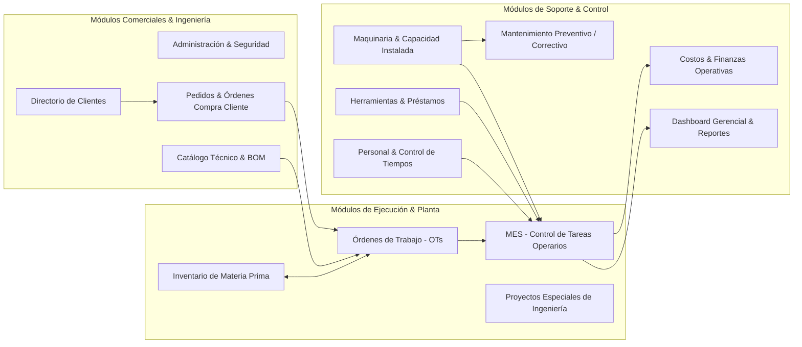
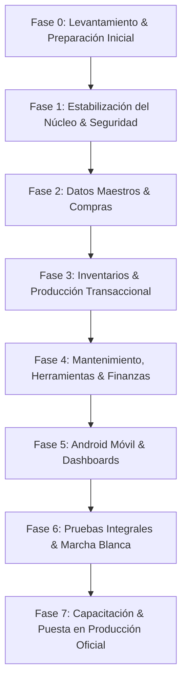

# Documento Formal de Alcance del Proyecto de Implementación
## MECAYTRO ERP / Control MT — Sistema MES & ERP de Manufactura Metalmecánica

---

# 1. Información General del Proyecto

* **Nombre del Proyecto:** Proyecto de Implementación, Estabilización y Puesta en Producción MECAYTRO ERP
* **Empresa Cliente:** MECANIZADOS Y TROQUELADOS S.A.S. (MECAYTRO)
* **Sistema:** MECAYTRO ERP / Control MT
* **Tipo de Proyecto:** Implementación, estabilización técnica, complementación funcional, integración móvil-nube y puesta en producción de sistema integral de gestión industrial (ERP/MES).
* **Estado Actual:** Sistema parcialmente desarrollado, auditado técnica y funcionalmente.
* **Objetivo General:** Llevar la plataforma tecnológica a un estado 100% operativo, estable, seguro y funcional para su utilización formal en las operaciones de planta y administrativas de MECAYTRO.

---

# 2. Resumen Ejecutivo

MECANIZADOS Y TROQUELADOS S.A.S. (MECAYTRO) es una empresa del sector metalmecánico especializada en mecanizado (tornos/centros de mecanizado), troquelado, soldadura y desarrollo de proyectos especiales de ingeniería. 

El presente proyecto surge de la necesidad de **eliminar el control manual en papel, hojas de cálculo dispersas y la falta de trazabilidad en tiempo real** en las órdenes de producción, inventarios de materia prima (láminas, barras, perfiles), herramientas de corte, mantenimiento de maquinaria y costeo real de fabricación.

Actualmente, MECAYTRO cuenta con una base tecnológica desarrollada en un 60% aproximadamente (frontend web en React/Tailwind, backend en Node.js/Express/TypeScript y base de datos PostgreSQL/Supabase). La auditoría técnica demostró que existen módulos con alto valor operativo (Catálogo Técnico con BOM, Registro de Tareas de Taller, Planes de Mantenimiento, Órdenes de Trabajo), pero que **presentan fallas críticas de integridad transaccional (el stock no se descuenta al terminar órdenes), brechas severas de seguridad (rutas desprotegidas y registro público abierto), desconexión en el aplicativo móvil Android (dependencia errónea de localhost y código SQLite descontinuado) y carencia de funcionalidades básicas (creación de clientes y módulo de compras/proveedores)**.

El proyecto de implementación busca **estabilizar el núcleo del software, corregir los defectos críticos de lógica industrial, desarrollar las piezas faltantes indispensables, desplegar la aplicación móvil Android conectada directamente a la nube vía Internet, capacitar al personal y acompañar la salida a producción**. 

### Áreas de la Empresa Impactadas
1. **Gerencia General & Financiera:** Visibilidad en tiempo real de rentabilidad por orden, OEE, costos de mano de obra y cumplimiento de entregas.
2. **Jefatura de Planta & Supervisión:** Control y asignación de órdenes de trabajo, seguimiento de operarios y cronometraje de paradas.
3. **Operarios de Taller:** Registro táctil/móvil simplificado de inicio/fin de tareas, reporte de piezas buenas y mermas (scrap).
4. **Almacén & Inventarios:** Control estricto de láminas, recepción de compras con remisiones digitales y Kardex valorizado.
5. **Ingeniería & Diseño:** Estandarización de fichas de producto, planos PDF, rutas de fabricación y listas de materiales (BOM).
6. **Mantenimiento:** Registro de fallas en máquina, cálculo de MTTR y ejecución de rutinas preventivas con evidencia fotográfica.

---

# 3. Objetivos del Proyecto

## 3.1. Objetivo General
Implementar, corregir, completar y poner en marcha productiva el sistema **MECAYTRO ERP / Control MT**, garantizando una arquitectura web y móvil robusta, segura y conectada en tiempo real a una base de datos centralizada en la nube, para optimizar la planificación, ejecución y control de los procesos de manufactura metalmecánica de la empresa.

## 3.2. Objetivos Específicos
* **Centralización de la Información:** Unificar en una única base de datos relacional PostgreSQL toda la información de clientes, productos, materias primas, personal, maquinaria, órdenes y costos.
* **Control Fidedigno de Inventarios:** Asegurar la integridad transaccional del Kardex de materia prima mediante reservas automáticas al emitir órdenes y deducción física real al completar la fabricación.
* **Trazabilidad Integral de Producción (MES):** Capturar tiempos reales de fabricación, horas-máquina, operarios asignados, piezas conformes y scrap por cada operación de la ruta.
* **Gestión Confiable de Mantenimiento:** Digitalizar el reporte de averías de planta, ejecución de órdenes de mantenimiento correctivo y programación de preventivos para elevar la disponibilidad de las máquinas.
* **Control de Herramientas y Consumibles:** Monitorear préstamos y devoluciones de insertos, brocas e instrumentos de medición, eliminando extravíos.
* **Movilidad en Planta (Android):** Habilitar el uso de la aplicación móvil Android en terminales de taller conectadas a Internet contra el servidor en la nube sin dependencias locales.
* **Seguridad y Confidencialidad:** Proteger el 100% de los endpoints del backend mediante autenticación JWT estricta y control de acceso basado en roles (RBAC).
* **Visibilidad Gerencial y Costeo Real:** Proveer dashboards con KPIs automáticos de productividad y reportes de margen real por orden de trabajo.

---

# 4. Alcance General del Proyecto

El alcance del proyecto comprende la ejecución completa de las siguientes fases y disciplinas de ingeniería:

1. **Análisis Funcional y Levantamiento de Datos:** Validación en planta de los flujos de taller, formatos de importación de pedidos, catálogos de operaciones y estructura de centros de trabajo.
2. **Estabilización de Arquitectura y Seguridad:** Cierre de brechas de autenticación, eliminación de endpoints públicos vulnerables, unificación del cliente Prisma singleton y securización de variables de entorno.
3. **Correcciones Transaccionales Críticas:** Corrección del ciclo de vida de inventarios en órdenes de trabajo, liberación de reservas en cancelaciones y corrección del desacoplamiento entre tareas de OT y catálogo maestro de rutas.
4. **Desarrollo de Funcionalidades Pendientes V1.0:** Formulario de alta de clientes (`CLI-002`), inactivación de materiales (`INV-007`), interactividad del Kanban de proyectos especiales (`ESP-004`) y módulo esencial de recepción de compras/proveedores.
5. **Estandarización y Despliegue Móvil Android:** Desmantelamiento definitivo de la deuda técnica de SQLite local, configuración de cliente Axios para consumo REST en la nube y generación del APK productivo.
6. **Optimización de Rendimiento y Base de Datos:** Creación de índices en claves foráneas, restricciones de unicidad compuestas y paginación en endpoints de alto tráfico.
7. **Parametrización y Migración de Datos:** Carga y validación de datos maestros de clientes, productos, BOMs, rutas, materias primas, personal y máquinas en PostgreSQL.
8. **Plan Integral de Pruebas:** Ejecución de pruebas funcionales, de seguridad, de integración, responsive, móviles y pruebas de aceptación con usuarios clave (UAT).
9. **Capacitación por Roles:** Entrenamiento formal a directivos, supervisores de planta, almacenistas y operarios.
10. **Puesta en Marcha (Go-Live) y Acompañamiento:** Salida en vivo controlada y soporte post-implementación en sitio/remoto.

---

# 5. Módulos Incluidos en el Alcance



---

### Módulo 1: Administración & Seguridad
* **Objetivo:** Garantizar la autenticación, autorización y configuración corporativa del sistema.
* **Funcionalidades Incluidas:** Inicio de sesión JWT, CRUD de usuarios administrativos, asignación de roles (Administrador, Supervisor, Operario, Almacén, Gerencia), parámetros globales de empresa (NIT, tolerancias, densidades) y personalización de temas visuales.
* **Estado Actual:** Parcialmente implementado. Presenta vulnerabilidad crítica de registro público abierto y rutas de configuración sin protección.
* **Trabajo Requerido:** Eliminar endpoint público de registro, aplicar middleware `authenticateToken` y `authorizeRole` en todos los controladores, configurar manejo de expiración de sesión (401/403) en frontend.
* **Dependencias:** Ninguna (Núcleo base).
* **Prioridad:** **CORE — OBLIGATORIO**
* **Resultado Esperado:** Sistema 100% protegido con acceso restringido exclusivamente a personal autorizado.

---

### Módulo 2: Directorio de Clientes
* **Objetivo:** Administrar la cartera de clientes comerciales, calificaciones y catálogo de piezas vinculadas.
* **Funcionalidades Incluidas:** Listado con búsqueda predictiva, creación de clientes (NIT, razón social, dirección, contacto), edición, calificación comercial (1-5 estrellas), vinculación masiva de productos y soft-delete con protección de histórico.
* **Estado Actual:** Incompleto. Falta el formulario y endpoint de creación de clientes (`CLI-002`).
* **Trabajo Requerido:** Desarrollar endpoint `POST /api/clients`, modal de alta de cliente en frontend, validación de identificación tributaria y pruebas de vinculación.
* **Dependencias:** Módulo 1 (Seguridad).
* **Prioridad:** **CORE — OBLIGATORIO**
* **Resultado Esperado:** Cartera de clientes plenamente gestionable desde la interfaz de usuario.

---

### Módulo 3: Pedidos de Clientes & Importador Excel
* **Objetivo:** Digitalizar y gestionar las órdenes de compra emitidas por clientes, controlando saldos y despachos.
* **Funcionalidades Incluidas:** Registro manual de pedidos, importación masiva desde archivos Excel (`.xlsx`), sincronización automática de estados (Pendiente, En Producción, En Inventario, Despachado Parcial/Completo) y generación automática de Órdenes de Trabajo (OT) con herencia de BOM y ruta.
* **Estado Actual:** Implementado pero sin autenticación en rutas y con falta de validación de cantidades ya ordenadas al generar OTs.
* **Trabajo Requerido:** Proteger endpoints con JWT, refactorizar validación en generación de OTs para evitar sobre-ordenar saldos y validar mapeo de columnas Excel.
* **Dependencias:** Módulo 2 (Clientes), Módulo 4 (Productos).
* **Prioridad:** **OPERATIVA — INCLUIDA**
* **Resultado Esperado:** Flujo fluido desde la OC del cliente hasta la emisión de la orden de producción.

---

### Módulo 4: Catálogo Técnico de Productos & BOM
* **Objetivo:** Estandarizar la ingeniería de piezas de serie, especificando planos, rutas de fabricación y listas de materiales.
* **Funcionalidades Incluidas:** Ficha técnica de piezas, carga de planos en PDF e imágenes a Cloudinary, Lista de Materiales (BOM) con consumos unitarios, Rutas de Fabricación con tiempos estándar y centros de trabajo, cálculo de aprovechamiento de lámina (piezas por lámina 4x8 / 2x1) y ajuste manual de producto terminado.
* **Estado Actual:** Implementado. Requiere corrección de restricciones compuestas en base de datos.
* **Trabajo Requerido:** Agregar restricción de unicidad en `ListaMateriales`, validar consistencia de tiempos estándar y pruebas de carga de archivos pesados.
* **Dependencias:** Módulo 2 (Clientes), Módulo 5 (Materia Prima).
* **Prioridad:** **CORE — OBLIGATORIO**
* **Resultado Esperado:** Maestro de ingeniería robusto que alimenta automáticamente las órdenes de trabajo.

---

### Módulo 5: Inventario de Materia Prima
* **Objetivo:** Controlar las existencias físicas, reservas y movimientos de láminas, barras y perfiles metálicos.
* **Funcionalidades Incluidas:** Maestro de materias primas con dimensiones y densidad, entradas de almacén vinculando foto de remisión del proveedor, ajustes manuales justificados, Kardex histórico de movimientos, reversión de movimientos y cálculo de stock disponible (`stock_actual - stock_reservado`).
* **Estado Actual:** Implementado. Requiere desacoplar SQLite en Android, añadir paginación en movimientos e implementar inactivación de materiales.
* **Trabajo Requerido:** Eliminar llamadas a SQLite local en `materiaPrimaRepository.ts`, paginar endpoint de Kardex, crear endpoint de inactivación segura.
* **Dependencias:** Módulo 1 (Seguridad).
* **Prioridad:** **CORE — OBLIGATORIO**
* **Resultado Esperado:** Kardex fidedigno y trazable con respaldo fotográfico de remisiones.

---

### Módulo 6: Producción & Órdenes de Trabajo (OT)
* **Objetivo:** Planificar, programar, costear y documentar las órdenes de fabricación en serie y proyectos especiales.
* **Funcionalidades Incluidas:** Creación de OTs de serie con reserva automática de láminas, creación de OTs especiales con catálogo de operaciones, detalle integral con seguimiento de tareas, cálculo de costos reales acumulados, duplicación de OTs, eliminación con reversión de reservas y exportación de ficha técnica en PDF con código de barras.
* **Estado Actual:** Defectuoso en puntos críticos: no descuenta stock real al finalizar ni libera reservas en cancelaciones.
* **Trabajo Requerido:** Reescribir la transacción de finalización de OT para descontar `stock_actual` y limpiar `stock_reservado`; implementar liberación de reserva en cambio a `Cancelada`; optimizar consulta de detalle.
* **Dependencias:** Módulo 4 (Productos), Módulo 5 (Materia Prima).
* **Prioridad:** **CORE — OBLIGATORIO**
* **Resultado Esperado:** Control exacto del flujo de órdenes con sincronización perfecta del inventario físico.

---

### Módulo 7: Ejecución de Taller & Tareas MES
* **Objetivo:** Proveer a los operarios y supervisores de una interfaz ágil para cronometrar operaciones y registrar calidad.
* **Funcionalidades Incluidas:** Tablero de tareas por operario/centro de trabajo, asignación de recursos y tiempos estimados, inicio de tarea (cronómetro), finalización con registro de piezas buenas, malas (scrap), tiempos muertos y cálculo automático de costo de mano de obra según catálogo.
* **Estado Actual:** Defectuoso en reordenamiento (altera el producto maestro).
* **Trabajo Requerido:** Corregir `reorderTasks` para que la secuencia de operaciones pertenezca exclusivamente a la OT instanciada y no altere `RutaFabricacion` global; adaptar vistas táctiles para planta.
* **Dependencias:** Módulo 6 (Órdenes de Trabajo), Módulo 9 (Máquinas), Módulo 12 (Personal).
* **Prioridad:** **CORE — OBLIGATORIO**
* **Resultado Esperado:** Sistema MES de taller ágil que captura datos reales sin corromper ingeniería.

---

### Módulo 8: Proyectos Especiales de Ingeniería
* **Objetivo:** Gestionar la fabricación de dispositivos, matrices, troqueles o proyectos metalmecánicos no estandarizados.
* **Funcionalidades Incluidas:** Dashboard de proyectos especiales, registro con planos generales, control de las 7 fases estándar, desglose de piezas con planos individuales y registros de avance, lista de materiales requeridos, bitácora de notas técnicas y reporte PDF de ingeniería.
* **Estado Actual:** Parcialmente implementado. La vista Kanban no persiste cambios en servidor y el controlador utiliza una instancia duplicada de Prisma.
* **Trabajo Requerido:** Conectar interactividad del Kanban de fases (`PUT /api/special-projects/:id/fases/:faseId`), unificar cliente Prisma a singleton e implementar validación de estados.
* **Dependencias:** Módulo 1 (Seguridad), Módulo 9 (Máquinas).
* **Prioridad:** **OPERATIVA — INCLUIDA**
* **Resultado Esperado:** Control estructurado de proyectos de ingeniería desde el diseño hasta las pruebas finales.

---

### Módulo 9: Maquinaria & Capacidad Instalada
* **Objetivo:** Administrar el parque de máquinas de planta, monitoreando su carga de trabajo y disponibilidad.
* **Funcionalidades Incluidas:** Ficha técnica de máquinas (tornos, fresas, troqueladoras, prensas, soldadura), categorización por áreas de producción, visualización de carga semanal de trabajo vs. capacidad, historial de órdenes ejecutadas y matriz de procesos habituales por producto.
* **Estado Actual:** Implementado. Requiere verificación de consistencia en recálculo de horas trabajadas.
* **Trabajo Requerido:** Validar transacciones de acumulación de horas de máquina provenientes del cierre de OTs y pruebas de carga.
* **Dependencias:** Módulo 1 (Seguridad).
* **Prioridad:** **OPERATIVA — INCLUIDA**
* **Resultado Esperado:** Visibilidad clara del uso y saturación de los centros de trabajo.

---

### Módulo 10: Mantenimiento Preventivo & Correctivo
* **Objetivo:** Maximizar la disponibilidad operativa de las máquinas mediante rutinas preventivas y atención rápida de fallas.
* **Funcionalidades Incluidas:** Catálogo de planes preventivos con frecuencias en días, programación de servicios, ejecución con checklist y hasta 5 fotos de evidencia en Cloudinary, reporte de fallas de planta con cambio automático de estado a "Fuera de Servicio", órdenes de mantenimiento correctivo (OM) con registro de repuestos/tiempos muertos y cálculo de KPIs (MTTR, inactividad total).
* **Estado Actual:** Altamente funcional y completo.
* **Trabajo Requerido:** Pruebas de integración, verificación de permisos por rol y optimización de carga de imágenes.
* **Dependencias:** Módulo 9 (Máquinas).
* **Prioridad:** **OPERATIVA — INCLUIDA**
* **Resultado Esperado:** Reducción de paradas no programadas y trazabilidad total del mantenimiento.

---

### Módulo 11: Herramientas & Préstamos de Almacén
* **Objetivo:** Controlar el inventario de herramientas de corte, instrumentos de medición y su flujo en taller.
* **Funcionalidades Incluidas:** Catálogo de herramientas y consumibles con stock total y disponible, registro de préstamos a operarios con descuento de inventario, registro de devoluciones con restitución de stock y trazabilidad de préstamos activos.
* **Estado Actual:** Defectuoso en devolución (captura de errores silenciada sin rollback transaccional).
* **Trabajo Requerido:** Envolver la devolución de herramientas en una transacción ACID estricta para garantizar que el stock disponible siempre se restituya al retornar el ítem.
* **Dependencias:** Módulo 12 (Personal).
* **Prioridad:** **OPERATIVA — INCLUIDA**
* **Resultado Esperado:** Cero pérdidas de herramientas y control exacto de quién tiene cada recurso.

---

### Módulo 12: Gestión de Personal & Nómina Operativa
* **Objetivo:** Administrar los colaboradores de planta, sus costos asociados, horas extras y dotaciones de seguridad.
* **Funcionalidades Incluidas:** Ficha de personal con salario, prestaciones y cálculo de costo hora-hombre base, registro masivo de horas extras (diurnas, nocturnas, festivas), control de estado de pago de recargos y registro de dotaciones EPP entregadas.
* **Estado Actual:** Implementado. Requiere corrección en eliminación para evitar violación de llaves foráneas.
* **Trabajo Requerido:** Implementar soft-delete (`activo = false`) en lugar de borrado físico en cascada para preservar historial de tareas y préstamos.
* **Dependencias:** Módulo 1 (Seguridad).
* **Prioridad:** **OPERATIVA — INCLUIDA**
* **Resultado Esperado:** Control riguroso de mano de obra y horas extras para alimentar el costeo real.

---

### Módulo 13: Costos & Finanzas Operativas
* **Objetivo:** Proporcionar análisis de costos de producción, mano de obra, maquinaria y márgenes de rentabilidad.
* **Funcionalidades Incluidas:** Resumen financiero global, costeo individual por orden de trabajo (materia prima + mano de obra + costos indirectos vs. precio venta), costeo operativo de máquinas con depreciación y cálculo de costo hora-hombre real basado en horas productivas reportadas.
* **Estado Actual:** Defectuoso en lógica conceptual de resumen global (suma inventarios como gasto y no acota fechas).
* **Trabajo Requerido:** Corregir fórmulas contables en `finances.controller.ts`, agregar selector de rango de fechas en consultas y separar activos de balance de costos del periodo.
* **Dependencias:** Módulo 5 (Materia Prima), Módulo 6 (OTs), Módulo 7 (Tareas), Módulo 12 (Personal).
* **Prioridad:** **CORE — OBLIGATORIO**
* **Resultado Esperado:** Reportes financieros fidedignos para toma de decisiones gerenciales.

---

### Módulo 14: Dashboard Gerencial & Reportes
* **Objetivo:** Brindar a la dirección una torre de control visual con indicadores clave de desempeño en tiempo real.
* **Funcionalidades Incluidas:** KPIs de planta (OTs activas, pendientes, completadas, eficiencia promedio, operarios activos), gráfica de tendencia de producción semanal en piezas, distribución porcentual de órdenes, comparativo de rendimiento entre áreas (Tornos, Mecanizado, Soldadura, Troquelería) y Generador de Reporte Mensual con exportación a PDF y Excel.
* **Estado Actual:** Implementado. Presenta error de sintaxis en query de alerta de stock y componentes mock huérfanos.
* **Trabajo Requerido:** Corregir query Prisma en `dashboard.controller.ts`, eliminar componentes mock no utilizados y verificar renderizado responsivo.
* **Dependencias:** Todos los módulos operativos.
* **Prioridad:** **OPERATIVA — INCLUIDA**
* **Resultado Esperado:** Panel de control gerencial automatizado sin generación manual de informes.

---

# 6. Matriz de Alcance Detallada

A continuación se presenta la matriz completa de las 84 funcionalidades identificadas, con su tipo de trabajo, prioridad, dependencias y criterio de aceptación formal:

| ID | Módulo | Submódulo | Funcionalidad | Situación Actual | Trabajo Requerido | Tipo de Trabajo | Prioridad | Dependencias | Incluido en V1 | Criterio de Aceptación Verificable |
| :--- | :--- | :--- | :--- | :--- | :--- | :--- | :--- | :--- | :---: | :--- |
| **ADM-001** | Administración | Auth | Login JWT | Implementada | Pruebas en Android | PRUEBAS | CORE | Ninguna | Sí | El usuario ingresa credenciales y recibe JWT válido de 24h. |
| **ADM-002** | Administración | Auth | Registro Público | Defectuosa (Vulnerable) | Eliminar ruta pública | CORRECCIÓN | CORE | Ninguna | Sí | Endpoint `POST /api/auth/register` no responde a usuarios anónimos. |
| **ADM-003** | Administración | Usuarios | CRUD Usuarios | Implementada | Validar roles | EXISTENTE | OPERATIVA | ADM-001 | Sí | Admin crea y desactiva usuarios asignando roles específicos. |
| **ADM-004** | Administración | Permisos | Control RBAC | Parcial | Proteger 100% rutas | CORRECCIÓN | CORE | ADM-001 | Sí | Todo endpoint rechaza peticiones sin token o con rol no autorizado (403). |
| **ADM-005** | Administración | Config | Parámetros Empresa | Defectuosa (Abierta) | Proteger con Auth | CORRECCIÓN | OPERATIVA | ADM-004 | Sí | Solo Administrador puede modificar NIT y parámetros de cálculo. |
| **ADM-006** | Administración | Config | Preferencias Usuario | Implementada | Validación UX | EXISTENTE | MEJORA | ADM-001 | Sí | El cambio de tema y paleta se persiste al recargar la app. |
| **CLI-001** | Comercial | Clientes | Listado y Búsqueda | Implementada | Optimizar query | EXISTENTE | CORE | ADM-001 | Sí | Listado muestra clientes y total de productos asociados en <1s. |
| **CLI-002** | Comercial | Clientes | Crear Cliente | Pendiente | Desarrollar endpoint/UI | DESARROLLO | CORE | ADM-004 | Sí | Formulario guarda cliente nuevo con NIT único en PostgreSQL. |
| **CLI-003** | Comercial | Clientes | Editar Cliente | Implementada | Pruebas funcionales | EXISTENTE | OPERATIVA | CLI-001 | Sí | Edición de dirección y contacto persiste inmediatamente. |
| **CLI-004** | Comercial | Clientes | Calificar Cliente | Implementada | Pruebas funcionales | EXISTENTE | MEJORA | CLI-001 | Sí | Modal asigna rating de 1 a 5 estrellas y se refleja en tarjeta. |
| **CLI-005** | Comercial | Clientes | Eliminar / Soft-Delete | Implementada | Validar reglas | EXISTENTE | OPERATIVA | CLI-001 | Sí | Cliente con historial se marca inactivo; sin historial se borra. |
| **CLI-006** | Comercial | Clientes | Vincular Productos | Implementada | Pruebas masivas | EXISTENTE | OPERATIVA | CLI-001, PRD-001 | Sí | Selección múltiple asocia productos al cliente en una transacción. |
| **PED-001** | Comercial | Pedidos | Listado Pedidos | Implementada | Proteger endpoint | CORRECCIÓN | OPERATIVA | ADM-004 | Sí | Filtros por cliente, estado y búsqueda de OC funcionan con JWT. |
| **PED-002** | Comercial | Pedidos | Crear Pedido | Implementada | Pruebas de cálculo | EXISTENTE | OPERATIVA | CLI-001 | Sí | Pedido calcula saldo pendiente e importe total correctamente. |
| **PED-003** | Comercial | Pedidos | Importador Excel | Implementada | Validar formatos | CONFIGURACIÓN | OPERATIVA | PRD-001 | Sí | Archivo `.xlsx` procesa pedidos enlazando SKU y fechas en español. |
| **PED-004** | Comercial | Pedidos | Generar OT desde Pedido| Parcial | Validar saldos | COMPLETAR | CORE | PED-001, PROD-001 | Sí | Genera OT de serie y actualiza estado del pedido a EN PRODUCCIÓN. |
| **PED-005** | Comercial | Pedidos | Sync de Estados | Implementada | Pruebas de flujo | EXISTENTE | OPERATIVA | PED-001, PROD-005 | Sí | Cambia a DESPACHADO o EN INVENTARIO según avance real. |
| **PRD-001** | Ingeniería | Productos | Catálogo Maestro | Implementada | Paginación | EXISTENTE | CORE | ADM-001 | Sí | Tarjetas muestran SKU, medidas, acabado y foto técnica. |
| **PRD-002** | Ingeniería | Productos | Planos PDF e Imágenes | Implementada | Pruebas Cloudinary | EXISTENTE | CORE | PRD-001 | Sí | Carga y previsualiza planos PDF de ingeniería sin errores. |
| **PRD-003** | Ingeniería | Productos | Lista Materiales (BOM)| Implementada | Añadir unicidad BD | CORRECCIÓN | CORE | PRD-001, INV-001 | Sí | Actualización de BOM reemplaza atómicamente la lista anterior. |
| **PRD-004** | Ingeniería | Productos | Rutas de Fabricación | Implementada | Validar tiempos | EXISTENTE | CORE | PRD-001 | Sí | Secuencia de operaciones guarda centro de trabajo y tiempos estándar. |
| **PRD-005** | Ingeniería | Productos | Aprovechamiento Lámina| Implementada | Pruebas fórmulas | EXISTENTE | OPERATIVA | PRD-001 | Sí | Calcula láminas necesarias según factor de piezas por lámina 4x8. |
| **PRD-006** | Ingeniería | Productos | Ajuste Stock Terminado | Implementada | Pruebas Kardex | EXISTENTE | OPERATIVA | PRD-001 | Sí | Registra entrada/salida de producto terminado con referencia. |
| **INV-001** | Inventarios | Materia Prima | Listado de Stock | Implementada | Desacoplar SQLite | CORRECCIÓN | CORE | ADM-001 | Sí | Muestra stock físico, reservado y disponible desde PostgreSQL. |
| **INV-002** | Inventarios | Materia Prima | Crear Material | Implementada | Pruebas cálculo peso | EXISTENTE | CORE | ADM-001 | Sí | Guarda material con dimensiones y peso unitario teórico. |
| **INV-003** | Inventarios | Materia Prima | Entrada por Compra | Implementada | Pruebas Cloudinary | EXISTENTE | CORE | INV-001 | Sí | Incrementa stock actual y guarda foto de remisión del proveedor. |
| **INV-004** | Inventarios | Materia Prima | Ajuste Manual | Implementada | Pruebas auditoría | EXISTENTE | OPERATIVA | INV-001 | Sí | Ajusta stock físico registrando tipo 'Ajuste' y motivo. |
| **INV-005** | Inventarios | Materia Prima | Kardex Movimientos | Implementada | Añadir paginación | COMPLETAR | CORE | INV-001 | Sí | Consulta movimientos ordenados cronológicamente con paginación. |
| **INV-006** | Inventarios | Materia Prima | Reversión Movimiento | Implementada | Pruebas transaccionales| EXISTENTE | OPERATIVA | INV-005 | Sí | Genera movimiento inverso y restablece stock anterior. |
| **INV-007** | Inventarios | Materia Prima | Inactivar Material | Pendiente | Desarrollar endpoint/UI | DESARROLLO | OPERATIVA | INV-001 | Sí | Permite deshabilitar material sin romper OTs históricas. |
| **PROD-001**| Producción | OTs | Crear OT Serie | Parcial | Validar stock láminas| COMPLETAR | CORE | PRD-003, INV-001 | Sí | Valida stock disponible, crea tareas y reserva láminas en MP. |
| **PROD-002**| Producción | OTs | Crear OT Especial | Implementada | Pruebas operativas | EXISTENTE | OPERATIVA | ADM-001 | Sí | Crea producto temporal y tareas desde catálogo de operaciones. |
| **PROD-003**| Producción | OTs | Listado y Filtros | Implementada | Desacoplar SQLite | CORRECCIÓN | CORE | ADM-001 | Sí | Filtra órdenes por estado y prioridad consumiendo API REST. |
| **PROD-004**| Producción | OTs | Detalle Integral OT | Implementada | Optimizar includes | EXISTENTE | CORE | PROD-003 | Sí | Muestra avance de tareas, tiempos, operarios y BOM asociado. |
| **PROD-005**| Producción | OTs | Finalización OT | Defectuosa (Stock no baja)| Reescribir transacción | CORRECCIÓN | CORE | PROD-001, INV-001 | Sí | Estado 'Completada' descuenta stock actual y libera reservas. |
| **PROD-006**| Producción | OTs | Cancelación OT | Defectuosa (Reserva fija)| Liberar reservas | CORRECCIÓN | CORE | PROD-001, INV-001 | Sí | Estado 'Cancelada' restaura stock reservado de materia prima. |
| **PROD-007**| Producción | OTs | Duplicar OT | Implementada | Pruebas funcionales | EXISTENTE | MEJORA | PROD-003 | Sí | Clona datos técnicos y genera nuevo correlativo de orden. |
| **PROD-008**| Producción | OTs | Eliminar OT | Implementada | Validar cascada | EXISTENTE | OPERATIVA | PROD-003 | Sí | Borra orden y revierte reservas si estaba pendiente. |
| **PROD-009**| Producción | OTs | Ficha PDF de Taller | Implementada | Validar logo/impresión | EXISTENTE | OPERATIVA | PROD-004 | Sí | Descarga PDF tamaño carta con especificaciones técnicas y ruta. |
| **TSK-001** | Producción | Tareas MES | Tablero Operarios | Implementada | Pruebas móviles | EXISTENTE | CORE | PROD-001 | Sí | Operario visualiza únicamente sus tareas asignadas y prioridad. |
| **TSK-002** | Producción | Tareas MES | Asignar Tarea | Implementada | Pruebas supervisor | EXISTENTE | CORE | TSK-001, PER-001 | Sí | Supervisor asigna operario, máquina y fecha programada. |
| **TSK-003** | Producción | Tareas MES | Iniciar Tarea | Implementada | Pruebas tiempo | EXISTENTE | CORE | TSK-001 | Sí | Guarda timestamp de inicio y pasa estado de OT a En Progreso. |
| **TSK-004** | Producción | Tareas MES | Finalizar Tarea | Implementada | Validar costo hora | EXISTENTE | CORE | TSK-003 | Sí | Registra piezas buenas, scrap y calcula costo según catálogo. |
| **TSK-005** | Producción | Tareas MES | Reordenar Tareas | Defectuosa (Muta master) | Desacoplar de Ruta | CORRECCIÓN | CORE | TSK-001 | Sí | Reordenar operaciones en OT no altera la ruta maestra del producto.|
| **TSK-006** | Producción | Tareas MES | Editar Tiempos Manual | Implementada | Validar permisos | EXISTENTE | OPERATIVA | ADM-004 | Sí | Supervisor ajusta tiempos y piezas con registro de auditoría. |
| **ESP-001** | Ingeniería | Proyectos | Dashboard Proyectos | Implementada | Pruebas de métricas | EXISTENTE | OPERATIVA | ADM-001 | Sí | Visualiza horas acumuladas, proyectos en riesgo y porcentaje. |
| **ESP-002** | Ingeniería | Proyectos | Ficha de Proyecto | Implementada | Validar límite max | EXISTENTE | OPERATIVA | ADM-005 | Sí | Valida que no exceda proyectos activos máximos permitidos. |
| **ESP-003** | Ingeniería | Proyectos | Gestión de Fases | Implementada | Pruebas transaccionales| EXISTENTE | OPERATIVA | ESP-002 | Sí | Registra y actualiza las 7 fases estándar de ingeniería. |
| **ESP-004** | Ingeniería | Proyectos | Kanban de Fases | Visual (Inerte) | Conectar endpoint | COMPLETAR | OPERATIVA | ESP-003 | Sí | Arrastrar tarjeta actualiza fase y recalcula avance en servidor. |
| **ESP-005** | Ingeniería | Proyectos | Control de Piezas | Implementada | Pruebas planos | EXISTENTE | OPERATIVA | ESP-002 | Sí | Asocia 2 planos técnicos por pieza y registra porcentaje. |
| **ESP-006** | Ingeniería | Proyectos | Materiales Proyecto | Implementada | Pruebas de lista | EXISTENTE | OPERATIVA | ESP-002 | Sí | Guarda lista de materiales especiales requeridos. |
| **ESP-007** | Ingeniería | Proyectos | Bitácora y Notas | Implementada | Pruebas de notas | EXISTENTE | MEJORA | ESP-002 | Sí | Guarda anotaciones técnicas con fecha y autor. |
| **ESP-008** | Ingeniería | Proyectos | Reporte PDF Proyecto | Implementada | Unificar Prisma | CORRECCIÓN | OPERATIVA | ESP-002 | Sí | Genera PDF desde backend con todas las fases y costos. |
| **MAC-001** | Mantenimiento| Maquinaria | Catálogo de Máquinas | Implementada | Pruebas Cloudinary | EXISTENTE | OPERATIVA | ADM-001 | Sí | Registro de tornos, fresas y prensas con HP y consumo. |
| **MAC-002** | Mantenimiento| Maquinaria | Carga Semanal | Implementada | Validar cálculos | EXISTENTE | OPERATIVA | MAC-001 | Sí | Muestra horas ocupadas vs. horas disponibles semanales (40h). |
| **MAC-003** | Mantenimiento| Maquinaria | Historial en OT | Implementada | Pruebas de trazabilidad| EXISTENTE | OPERATIVA | MAC-001, TSK-004 | Sí | Lista todas las OTs y operarios que trabajaron en el equipo. |
| **MAC-004** | Mantenimiento| Maquinaria | Procesos Habituales | Implementada | Pruebas de matriz | EXISTENTE | MEJORA | MAC-001, PRD-001 | Sí | Relaciona qué operaciones realiza cada máquina por producto. |
| **MNT-001** | Mantenimiento| Preventivo | Planes de Mantenimiento| Implementada | Pruebas de frecuencia | EXISTENTE | OPERATIVA | MAC-001 | Sí | Configura rutinas con frecuencia en días y checklist. |
| **MNT-002** | Mantenimiento| Preventivo | Programar Mantenimiento| Implementada | Pruebas calendario | EXISTENTE | OPERATIVA | MNT-001 | Sí | Genera orden de servicio preventivo con fecha y responsable. |
| **MNT-003** | Mantenimiento| Preventivo | Cierre Preventivo | Implementada | Pruebas fotos | EXISTENTE | OPERATIVA | MNT-002 | Sí | Cierra preventivo adjuntando hasta 5 fotos y costos reales. |
| **MNT-004** | Mantenimiento| Correctivo | Reportar Falla | Implementada | Pruebas estado máquina| EXISTENTE | CORE | MAC-001 | Sí | Reporte de avería cambia máquina a 'Fuera de servicio'. |
| **MNT-005** | Mantenimiento| Correctivo | Orden Mantenimiento | Implementada | Pruebas de apertura | EXISTENTE | OPERATIVA | MNT-004 | Sí | Abre OM correctiva vinculada o no a la falla reportada. |
| **MNT-006** | Mantenimiento| Correctivo | Cierre OM | Implementada | Pruebas transaccionales| EXISTENTE | CORE | MNT-005 | Sí | Registra repuestos, tiempo muerto y restablece a 'Operativa'. |
| **MNT-007** | Mantenimiento| Indicadores | KPIs de Mtto (MTTR) | Implementada | Pruebas fórmulas | EXISTENTE | OPERATIVA | MNT-006 | Sí | Calcula MTTR (horas promedio de reparación) y tiempo inactivo. |
| **TLS-001** | Herramientas | Catálogo | Stock de Herramientas | Implementada | Pruebas de stock | EXISTENTE | OPERATIVA | ADM-001 | Sí | Controla cantidades totales, prestadas y disponibles. |
| **TLS-002** | Herramientas | Préstamos | Prestar Herramienta | Implementada | Pruebas transaccionales| EXISTENTE | OPERATIVA | TLS-001, PER-001 | Sí | Descuenta stock disponible y marca 'EN USO'. |
| **TLS-003** | Herramientas | Préstamos | Devolver Herramienta | Defectuosa (Error catch)| Transacción estricta | CORRECCIÓN | OPERATIVA | TLS-002 | Sí | Restituye stock disponible y marca préstamo como 'DEVUELTO'. |
| **PER-001** | Personal | Empleados | Maestro de Personal | Implementada | Validar cédula única | EXISTENTE | OPERATIVA | ADM-001 | Sí | Ficha con salario, recargos y costo hora-hombre base. |
| **PER-002** | Personal | Empleados | Eliminar Personal | Defectuosa (FK error) | Migrar a soft-delete | CORRECCIÓN | OPERATIVA | PER-001 | Sí | Desactiva colaborador (`activo=false`) preservando historial. |
| **PER-003** | Personal | Tiempo | Horas Extras Masivas | Implementada | Pruebas transaccionales| EXISTENTE | OPERATIVA | PER-001 | Sí | Carga masiva de horas diurnas/nocturnas/festivas y costos. |
| **PER-004** | Personal | Tiempo | Control Pago Extras | Implementada | Pruebas de switch | EXISTENTE | MEJORA | PER-003 | Sí | Alterna estado pagado/pendiente de horas extras. |
| **PER-005** | Personal | EPP | Entrega de Dotación | Implementada | Pruebas de entrega | EXISTENTE | MEJORA | PER-001 | Sí | Registra ítems de protección entregados con comentarios. |
| **FIN-001** | Finanzas | Rentabilidad | Resumen Financiero | Defectuosa (Fórmulas) | Corregir lógica contable| CORRECCIÓN | CORE | PROD-001, PER-001 | Sí | Muestra ingresos, costos y margen acotados por rango de fecha. |
| **FIN-002** | Finanzas | Costeo | Costos por OT | Implementada | Validar rentabilidad | EXISTENTE | CORE | PROD-004 | Sí | Desglosa costo MP, mano de obra y margen porcentual por orden. |
| **FIN-003** | Finanzas | Costeo | Costos de Máquinas | Implementada | Pruebas depreciación | EXISTENTE | OPERATIVA | MAC-001 | Sí | Calcula costo operativo por horas trabajadas y depreciación. |
| **FIN-004** | Finanzas | Costeo | Costo Hora-Hombre Real| Implementada | Validar horas reales | EXISTENTE | OPERATIVA | PER-001, TSK-004 | Sí | Compara nómina devengada vs. horas reales productivas. |
| **DSH-001** | Dashboard | Gerencial | KPIs de Planta | Implementada | Corregir query stock | CORRECCIÓN | OPERATIVA | ADM-001 | Sí | Panel muestra OTs activas, eficiencia, operarios y alertas. |
| **DSH-002** | Dashboard | Gerencial | Tendencia Semanal | Implementada | Pruebas Recharts | EXISTENTE | OPERATIVA | TSK-004 | Sí | Gráfica de área muestra piezas producidas en últimos 7 días. |
| **DSH-003** | Dashboard | Gerencial | Distribución OTs | Implementada | Pruebas Recharts | EXISTENTE | MEJORA | PROD-003 | Sí | Gráfico de torta refleja proporción real de estados de orden. |
| **DSH-004** | Dashboard | Gerencial | Rendimiento por Área | Implementada | Pruebas BarChart | EXISTENTE | OPERATIVA | TSK-004 | Sí | Comparativo de piezas y OTs entre Tornos, Soldadura, etc. |
| **DSH-005** | Dashboard | Reportes | Reporte Mensual PDF | Implementada | Pruebas jsPDF | EXISTENTE | OPERATIVA | DSH-001 | Sí | Genera informe ejecutivo mensual con ranking de operarios. |
| **DSH-006** | Dashboard | UI | Streaming Tareas Live | Visual (Mock) | Eliminar o conectar | CORRECCIÓN | MEJORA | TSK-001 | No | Reemplazado por listado real de tareas activas. |
| **DSH-007** | Dashboard | UI | Tarjetas Mock Pulso | Visual (Mock) | Eliminar del layout | CORRECCIÓN | MEJORA | Ninguna | No | Se remueven tarjetas simuladas de cumplimiento. |
| **AND-001** | Android | Conexión | Conexión Cloud REST | Defectuosa (Localhost) | Configurar API URL | CORRECCIÓN | CORE | ADM-001 | Sí | APK conecta a `https://api.mecaytro.com` sin error. |
| **AND-002** | Android | Legacy | Desacople SQLite | Defectuosa (Bifurcación)| Unificar a Axios REST | CORRECCIÓN | CORE | AND-001 | Sí | Todos los módulos en Android consumen PostgreSQL vía REST. |
| **AND-003** | Android | Sync | Endpoints Sync Legacy | Defectuosa (Inseguros) | Deprecar / Proteger | CORRECCIÓN | CORE | ADM-004 | Sí | Endpoints de sincronización cruda cerrados. |
| **AND-004** | Android | Seguridad | Network Security | Defectuosa (IP fija) | HTTPS estricto | CORRECCIÓN | CORE | AND-001 | Sí | AndroidManifest configurado sin IPs locales ni cleartext. |

---

# 7. Clasificación de Requerimientos

### 7.1. CORE — OBLIGATORIO (26 Requerimientos)
*Funcionalidades indispensables sin las cuales el sistema no puede operar en producción.*
* **Seguridad:** ADM-001, ADM-002, ADM-004, AND-001, AND-002, AND-003, AND-004.
* **Datos Maestros:** CLI-001, CLI-002, PRD-001, PRD-002, PRD-003, PRD-004, INV-001, INV-002.
* **Inventario & Kardex:** INV-003, INV-005, PROD-005, PROD-006.
* **Producción & Taller:** PROD-001, PROD-003, PROD-004, TSK-001, TSK-002, TSK-003, TSK-004, TSK-005.
* **Mantenimiento Crítico:** MNT-004, MNT-006.
* **Finanzas Base:** FIN-001, FIN-002.

### 7.2. OPERATIVA — INCLUIDA (44 Requerimientos)
*Funcionalidades necesarias para la operación normal, estandarización y eficiencia del taller.*
* ADM-003, ADM-005, CLI-003, CLI-005, CLI-006, PED-001, PED-002, PED-003, PED-004, PED-005, PRD-005, PRD-006, INV-004, INV-006, INV-007, PROD-002, PROD-008, PROD-009, TSK-006, ESP-001, ESP-002, ESP-003, ESP-004, ESP-005, ESP-006, ESP-008, MAC-001, MAC-002, MAC-003, MNT-001, MNT-002, MNT-003, MNT-005, MNT-007, TLS-001, TLS-002, TLS-003, PER-001, PER-002, PER-003, FIN-003, FIN-004, DSH-001, DSH-002, DSH-004, DSH-005.

### 7.3. MEJORA — OPCIONAL (10 Requerimientos)
*Mejoras secundarias y de comodidad visual incluidas si el cronograma lo permite.*
* ADM-006, CLI-004, PROD-007, ESP-007, MAC-004, PER-004, PER-005, DSH-003, DSH-006, DSH-007.

### 7.4. FUTURA — FUERA DE V1.0 (4 Requerimientos)
*Funcionalidades avanzadas reservadas para etapas posteriores de madurez digital.*
* Módulo de Cotizaciones Comerciales con Estimador Automático de Mecanizado, Algoritmo de Programación Finita de Capacidad (Gantt Dinámico), Integración IoT para captura automática de pulsos en prensas/tornos, y Módulo Integral de Compras y Evaluación de Proveedores ISO.

---

# 8. Definición de la Versión 1.0 Productiva (MECAYTRO ERP V1.0)

La versión **MECAYTRO ERP V1.0 PRODUCTIVA** se define formalmente como la entrega de una plataforma digital estable que cumple con los siguientes criterios operativos:

1. **Cero Brechas Críticas de Seguridad:** 100% de los endpoints del backend protegidos con JWT y roles validados; eliminación de endpoints anónimos de registro.
2. **Kardex 100% Consistente:** Cada orden de producción reserva láminas teóricas al crearse, descuenta el stock real al finalizarse y libera reservas en caso de anulación.
3. **Catálogos Desacoplados:** Las modificaciones o reordenamientos de tareas en planta afectan únicamente la orden en curso y nunca corrompen las rutas maestras de ingeniería.
4. **App Android 100% Conectada a la Nube:** Aplicación móvil operando vía HTTPS contra el servidor central sin código muerto de SQLite local ni configuraciones manuales de red.
5. **Autosuficiencia en Datos Maestros:** Capacidad nativa de registrar, editar y administrar clientes, productos, materias primas, máquinas y personal desde la interfaz.
6. **Costeo y Métricas Confiables:** Desglose exacto de costos de materiales, mano de obra y horas máquina por orden para evaluación gerencial de márgenes.

---

# 9. Seguridad Informática

### 9.1. Riesgos Identificados y Tratamiento Obligatorio para Producción
* **Riesgo Crítico (SEC-01): Registro Público Expuesto.**
  * *Acción:* Deshabilitar y eliminar la ruta `POST /api/auth/register`. La creación de usuarios se centraliza exclusivamente en `POST /api/users` bajo rol `Administrador`.
* **Riesgo Crítico (SEC-02): Endpoints de Sincronización Abiertos.**
  * *Acción:* Eliminar las rutas `POST /api/sync/push` y `GET /api/sync/pull` al migrar definitivamente a la arquitectura online.
* **Riesgo Alto (SEC-03): Rutas de Parámetros sin Token.**
  * *Acción:* Aplicar `authenticateToken` y `authorizeRole(['Administrador'])` a todos los métodos de `settings.routes.ts`.
* **Riesgo Alto (SEC-04): Rutas de Pedidos sin Token.**
  * *Acción:* Proteger `pedidos.routes.ts` con middleware `authenticateToken`.
* **Riesgo Alto (SEC-05): Secreto JWT por Defecto.**
  * *Acción:* Validar en el arranque del servidor (`server.ts`) la presencia obligatoria de la variable `JWT_SECRET`; abortar ejecución (`process.exit(1)`) si no está definida en producción.
* **Riesgo Medio (SEC-06): Configuración de CORS Permisiva.**
  * *Acción:* Restringir los orígenes permitidos en Express exclusivamente al dominio web y subdominios oficiales de MECAYTRO.

---

# 10. Inventarios de Materia Prima

El alcance del módulo de inventarios en V1.0 cubre la totalidad del flujo físico de láminas y perfiles:

1. **Gestión de Materia Prima:** Control de calibres, dimensiones (ancho, largo, espesor), densidades de acero (default 7.85 g/cm³), cálculo de peso unitario y costo unitario promedio.
2. **Kardex Transaccional:** Registro inmutable de cada movimiento indicando fecha/hora, usuario, tipo de movimiento (`Ingreso Compra`, `En proceso`, `Ajuste`, `Consumo Real`, `Reversión`), cantidad en unidad de medida física y referencia cruzada con número de OT.
3. **Gestión de Reservas:** Cálculo del stock disponible en tiempo real:
   $$\text{Stock Disponible} = \text{Stock Físico Actual} - \text{Stock Reservado por OTs Activas}$$
4. **Recepción con Evidencia Digital:** Captura y almacenamiento en Cloudinary de fotos de remisiones de proveedores al ingresar compras.
5. **Reversión y Auditoría:** Capacidad de supervisores para anular movimientos erróneos generando la contrapartida automática en el inventario.

---

# 11. Producción & Ejecución de Planta (MES)

El alcance de producción en V1.0 abarca la gestión integral del taller:

```
[Pedido de Cliente / OC] 
       ↓ 
[Generación de Orden de Trabajo (OT)] 
       ↓ (Reserva automática de Láminas en Materia Prima)
[Explosión de Tareas de Ruta] 
       ↓ (Asignación de Operarios y Centros de Trabajo: Tornos, Fresa, Troquel, Soldadura)
[Ejecución en Taller (App Móvil / Web)] 
       ↓ (Cronometraje de inicio/fin, registro de paradas, piezas buenas y scrap)
[Cierre Técnico de OT] 
       ↓ (Descuento real de Stock en Inventario, acumulación de Horas-Máquina y Costeo Final)
[Entrega a Producto Terminado / Despacho]
```

* **Órdenes de Serie:** Enlace directo con ficha de producto, herencia automática de lista de materiales (BOM), cálculo de láminas según factor de piezas por lámina (4x8 o 2x1) y secuencia de operaciones.
* **Órdenes de Proyectos Especiales:** Asignación dinámica de operaciones desde el catálogo general de procesos sin requerir producto previo en catálogo.
* **Control de Tiempos y Costeo MES:** Registro exacto de horas hombre invertidas por operación para calcular el costo de mano de obra real versus el costo estándar estimado.

---

# 12. Mantenimiento Industrial

* **Maquinaria:** Control de fichas técnicas, potencia (HP), consumo eléctrico, ubicación en planta, responsable, horas acumuladas de operación y costos por hora.
* **Mantenimiento Preventivo:** Creación de rutinas con periodicidad en días (lubricación, calibración, inspección eléctrica), generación de órdenes programadas y cierre con checklist y hasta 5 fotos de respaldo.
* **Mantenimiento Correctivo:** Mecanismo ágil para que los operarios reporten averías desde el taller, cambiando de inmediato el estado del equipo a "Fuera de Servicio". Cierre de la orden correctiva indicando tiempo muerto (downtime), repuestos utilizados y costo total, restableciendo el equipo a "Operativa".
* **Indicadores:** Cálculo automatizado del MTTR (Mean Time to Repair) y disponibilidad acumulada.

---

# 13. Herramientas & Préstamos de Almacén

* **Catálogo Técnico:** Registro de herramientas de corte (insertos, fresas, brocas, machuelos) e instrumentos de metrología (calibradores pie de rey, micrómetros, comparadores).
* **Control de Existencias:** Seguimiento estricto de cantidad total, cantidad en uso en taller y cantidad disponible en pañol de herramientas.
* **Préstamos y Devoluciones:** Asignación formal de herramientas a operarios con fecha/hora y registro de devolución transaccional seguro.

---

# 14. Control de Calidad

### 14.1. Alcance Incluido en V1.0
* Registro de piezas conformes (buenas) y no conformes (scrap/mermas) al finalizar cada tarea operativa en taller.
* Tasa de calidad porcentual por orden de trabajo y por centro productivo en el Dashboard Gerencial:
  $$\text{Tasa de Calidad} = \left( \frac{\text{Piezas Buenas}}{\text{Piezas Buenas} + \text{Piezas Malas}} \right) \times 100$$
* Trazabilidad de motivos de rechazo en tareas de operario.

### 14.2. Alcance para Versiones Posteriores (Fuera de V1.0)
* Protocolos formales de liberación de primera pieza con registro de cotas dimensionales e instrumentos utilizados.
* Módulo integral de No Conformidades (NCR) y Acciones Correctivas y Preventivas (CAPA) con metodología 8D.

---

# 15. Aplicación Móvil Android (Capacitor)

### 15.1. Arquitectura Tecnológica Objetivo

```
┌─────────────────────────────────────────────────────────┐
│              Dispositivo Android en Planta              │
│       (Tablet Industrial / Smartphone de Operario)      │
│                                                         │
│   Capacitor WebView (HTML5 / React 18 / TailwindCSS)    │
│                            │                            │
│                  Cliente HTTP Axios                     │
└────────────────────────────┼────────────────────────────┘
                             │ HTTPS (Internet / WiFi)
                             ▼
┌─────────────────────────────────────────────────────────┐
│               Servidor Backend Central                  │
│             Node.js / Express / TypeScript              │
│                            │                            │
│                       Prisma ORM                        │
└────────────────────────────┼────────────────────────────┘
                             │ TCP / SSL
                             ▼
┌─────────────────────────────────────────────────────────┐
│           Base de Datos PostgreSQL (Supabase)           │
└─────────────────────────────────────────────────────────┘
```

### 15.2. Plan de Transición Móvil
1. **Depuración de Deuda Técnica SQLite:** Reemplazar en los repositorios (`ordenTrabajoRepository`, `materiaPrimaRepository`, `taskRepository`) las consultas locales a SQLite por llamadas unificadas mediante el cliente Axios central.
2. **Eliminación de Direcciones Hardcodeadas:** Remover la IP fija `192.168.2.18` y resolver la URL base del backend desde la variable de entorno `VITE_API_URL` configurada para producción HTTPS.
3. **Seguridad en AndroidManifest:** Configurar `network_security_config.xml` para exigir conexiones TLS/HTTPS seguras hacia el dominio del servidor.
4. **Validación de Funcionalidades Móviles:** Pruebas de usabilidad en taller: inicio/fin de tareas, consulta de planos PDF, registro de fallas de máquina y captura de fotos con la cámara nativa del dispositivo.

---

# 16. Migración de Datos Iniciales

Para la puesta en marcha de MECAYTRO ERP V1.0 se define el siguiente alcance de migración:

| Entidad de Datos | Fuente de Información | Formato de Carga | Estado de Disponibilidad |
| :--- | :--- | :--- | :--- |
| **Clientes** | Registros comerciales MECAYTRO | Plantilla Excel / Carga Masiva | **PENDIENTE DE LEVANTAMIENTO** |
| **Productos de Serie** | Catálogo técnico / Fichas de ingeniería | Archivo CSV / Script Prisma Seed | **Parcialmente disponible en seed** |
| **Listas de Materiales (BOM)**| Planos y especificaciones de producto | Carga relacional Prisma | **Parcialmente disponible en seed** |
| **Rutas de Fabricación** | Tiempos estándar de taller | Carga relacional Prisma | **Parcialmente disponible en seed** |
| **Materias Primas (Láminas)**| Inventario físico inicial de almacén | Plantilla Excel | **PENDIENTE DE LEVANTAMIENTO** |
| **Maquinaria** | Inventario de equipos de planta | Script Prisma Seed | **Disponible en seed (19 máquinas)**|
| **Personal Operativo** | Nómina y registro de colaboradores | Plantilla Excel | **Parcialmente disponible en seed** |
| **Herramientas de Pañol** | Conteo físico inicial de herramientas | Plantilla Excel | **PENDIENTE DE LEVANTAMIENTO** |

---

# 17. Parametrización del Sistema

Elementos a parametrizar formalmente para la operación de MECAYTRO:
1. **Centros de Trabajo / Áreas:** Tornos, Centros de Mecanizado, Troquelería, Soldadura, Ensamble, Acabados.
2. **Catálogo de Operaciones Estándar:** Torneado, Fresado, Troquelado, Corte Lámina, Soldadura MIG/TIG, Roscado, Pulido, Pintura.
3. **Usuarios y Permisos:** Creación de cuentas con roles diferenciados: Gerencia, Administrador, Jefe de Planta, Supervisor, Almacenista, Operario.
4. **Parámetros Globales:** Razón social, NIT, dirección, teléfono, densidad de aceros (Cold Rolled, Hot Rolled, Inoxidable), horas por turno laboral y días de alerta por retraso.

---

# 18. Estrategia y Plan de Pruebas

```
┌───────────────────────────────────────────────────────────────────┐
│                    PIRÁMIDE DE PRUEBAS DEL ERP                    │
│                                                                   │
│                 [ Pruebas de Aceptación UAT ]                     │
│               (Validación con Usuarios de Planta)                 │
│                                                                   │
│              [ Pruebas de Integración y Flujo ]                   │
│             (Ciclo Pedido → OT → MES → Inventario)                │
│                                                                   │
│             [ Pruebas de Seguridad y Permisos ]                   │
│           (Inyección, JWT, Rutas Protegidas, RBAC)                │
│                                                                   │
│         [ Pruebas de Dispositivos Móviles Android ]               │
│          (Cámara, Responsive, WiFi Taller, WebView)               │
│                                                                   │
│       [ Pruebas Transaccionales de Base de Datos ]                │
│        (ACID, Descuento Stock, Reservas, Integridad)              │
└───────────────────────────────────────────────────────────────────┘
```

1. **Pruebas Transaccionales de Base de Datos:** Verificación de atomicidad en creación de OTs, descuento de inventario, reversión de movimientos y cálculo de costos.
2. **Pruebas de Seguridad:** Validación de rechazo (401/403) en endpoints desprotegidos, expiración de tokens y restricción de acciones por rol.
3. **Pruebas de Integración:** Ejecución del flujo completo de manufactura (Creación de Pedido → Generación de OT → Inicio de Tarea en Android → Registro de Scrap → Cierre de OT → Kardex de Materia Prima y Producto Terminado).
4. **Pruebas en Dispositivos Android:** Evaluación de desempeño en tablets y teléfonos de diferentes resoluciones operando sobre la red WiFi de planta.
5. **Pruebas de Aceptación de Usuario (UAT):** Sesiones guiadas con el Jefe de Planta, Almacenista y Administrador para validación de criterios de aceptación antes del Go-Live.

---

# 19. Criterios de Aceptación Generales

El proyecto se considerará técnicamente aceptado cuando se verifiquen formalmente los siguientes criterios:

* **Seguridad:** Ninguna petición HTTP sin token JWT válido puede acceder a datos protegidos; no existe ningún endpoint público de registro de usuarios.
* **Inventario:** Al completar una orden de trabajo con 10 láminas consumidas, el stock físico de la materia prima en PostgreSQL disminuye exactamente en 10 unidades y el stock reservado vuelve a cero.
* **Cancelación de OTs:** Al cancelar una orden pendiente con 5 láminas reservadas, el stock reservado disminuye en 5 unidades y el stock disponible aumenta automáticamente.
* **Integridad de Catálogos:** Al alterar el orden de tareas en una OT particular, la tabla `RutaFabricacion` del producto original permanece inalterada.
* **Conectividad Móvil:** La aplicación Android instalada en un dispositivo móvil realiza login, consulta tareas y reporta avances conectándose exitosamente al servidor central en la nube.
* **Clientes:** Un usuario Administrador puede crear un nuevo cliente desde la interfaz web y asociarle productos del catálogo.
* **Costeo:** El reporte financiero refleja el costo real de materia prima y mano de obra acumulado en cada orden sin incluir activos de inventario como gasto.

---

# 20. Proceso y Metodología de Implementación



El despliegue en MECAYTRO se ejecutará bajo una metodología estructurada en 8 etapas lógicas:
1. **Preparación y Entorno:** Configuración de servidores cloud (Supabase PostgreSQL, Backend Express en Railway/AWS, Frontend en Vercel).
2. **Refactorización y Seguridad:** Corrección de brechas, transacciones ACID y eliminación de SQLite.
3. **Carga de Datos Maestros:** Migración de productos, rutas, máquinas y personal.
4. **Pruebas Técnicas Internas:** Verificación de código, endpoints y rendimiento.
5. **Capacitación a Usuarios Clave:** Entrenamiento a supervisores y administrativos.
6. **Prueba Piloto (Marcha Blanca):** Operación en paralelo durante 1 semana en una línea piloto (ej. Tornos o Troquelería).
7. **Ajustes Finales:** Corrección de hallazgos del piloto.
8. **Salida a Producción Definitiva (Go-Live):** Corte de sistemas manuales e inicio formal del ERP en toda la planta.

---

# 21. Plan de Capacitación por Áreas

| Grupo de Capacitación | Participantes | Módulos a Capacitar | Modalidad | Horas Est. |
| :--- | :--- | :--- | :--- | :---: |
| **Grupo 1: Gerencia & Finanzas** | Gerente General, Contador | Dashboard, Costos y Finanzas, Reportes Gerenciales | Teórico / Práctico | 6 h |
| **Grupo 2: Supervisión & Ingeniería**| Jefe de Planta, Diseñador | Catálogo Productos, BOM, Rutas, OTs, Proyectos Especiales | Práctico en PC | 12 h |
| **Grupo 3: Almacén & Abastecimiento**| Almacenista | Materia Prima, Kardex, Remisiones, Herramientas | Práctico en PC/Móvil | 8 h |
| **Grupo 4: Mantenimiento** | Técnico de Mantenimiento | Maquinaria, Planes Preventivos, Fallas, OMs | Práctico en Móvil/PC | 6 h |
| **Grupo 5: Operarios de Taller** | Torneros, Fresadores, Soldadores | Tablero MES en Móvil, Inicio/Fin de Tareas, Scrap | Práctico en Planta | 8 h |
| **Total Horas de Capacitación** | | | | **40 h** |

---

# 22. Soporte Post-Implementación y Garantía

* **Soporte de Estabilización (Hiper-cuidado):** Acompañamiento presencial/remoto intensivo durante las primeras 2 semanas posteriores al Go-Live para resolver dudas operativas y ajustes menores.
* **Garantía Técnica:** Corrección de defectos o bugs atribuibles al software desarrollado sin costo adicional durante el periodo de garantía pactado.
* **Mesa de Ayuda:** Canal directo de atención para reporte de incidencias técnicas y operativas.

---

# 23. Mapa de Dependencias del Sistema

```
[Administración & Seguridad]
       ↓
[Clientes & Proveedores] ──→ [Materia Prima] ──→ [Lista de Materiales - BOM]
                                                        ↓
[Personal] ───────────────→ [Catálogo Operaciones] ──→ [Ruta de Fabricación]
                                                        ↓
[Maquinaria] ─────────────→ [Capacidad Instalada] ───→ [Órdenes de Trabajo - OTs]
                                                        ↓
[Herramientas] ───────────────────────────────────────→ [Ejecución Tareas MES]
                                                        ↓
                                              [Control de Calidad & Scrap]
                                                        ↓
                                              [Cierre de OT & Kardex Real]
                                                        ↓
                                              [Costeo Real & Dashboard Gerencial]
```

---

# 24. Matriz de Riesgos y Mitigación

| ID | Riesgo Identificado | Probabilidad | Impacto | Estrategia de Mitigación |
| :--- | :--- | :---: | :---: | :--- |
| **RSK-01** | **Resistencia del personal de planta:** Operarios reacios al uso de terminales móviles. | Alta | Alto | Diseñar interfaces ultra-simplificadas con botones grandes; capacitación práctica en puesto de trabajo. |
| **RSK-02** | **Inconsistencia en inventario físico inicial:** Conteos iniciales de láminas erróneos en almacén. | Alta | Crítico | Realizar un inventario físico al 100% el fin de semana previo al Go-Live antes de cargar el Kardex inicial. |
| **RSK-03** | **Fallas de cobertura WiFi en planta:** Zonas de taller con sombra de señal para las tablets. | Media | Alto | Instalar Access Points industriales de alta potencia con línea de vista hacia las máquinas principales. |
| **RSK-04** | **Falta de disponibilidad de usuarios clave:** Supervisores ocupados en urgencias del taller durante capacitación. | Media | Medio | Acordar cronograma de capacitación en bloques de 1.5 horas al inicio o final de turno con respaldo de Gerencia. |
| **RSK-05** | **Duplicidad de órdenes por hábitos anteriores:** Registro simultáneo en papel y sistema. | Media | Medio | Decretar el corte definitivo de formatos físicos una vez finalizado el periodo de marcha blanca. |

---

# 25. Roadmap de Implementación por Fases

* **FASE 0: Levantamiento de Datos y Preparación de Infraestructura**
  * Configuración de servidores cloud, repositorios de código y diseño de plantillas de migración de datos.
* **FASE 1: Estabilización del Núcleo, Seguridad y Transaccionalidad**
  * Cierre de brechas de seguridad (SEC-01 a SEC-06), corrección transaccional de inventario en OTs (PROD-005, PROD-006) y desacople de rutas maestras (TSK-005).
* **FASE 2: Datos Maestros, Clientes y Catálogo de Ingeniería**
  * Formulario de alta de clientes (CLI-002), validaciones en BOMs, rutas de fabricación y carga de planos técnicos.
* **FASE 3: Inventarios de Materia Prima y Compras**
  * Inactivación de materiales (INV-007), paginación de movimientos, recepción de compras con remisiones y Kardex.
* **FASE 4: Producción de Serie, Proyectos Especiales y Tareas MES**
  * Flujo integral de OTs, sincronización con pedidos, conexión del Kanban de proyectos (ESP-004) y módulo MES de taller.
* **FASE 5: Mantenimiento, Herramientas, Personal y Finanzas**
  * Transacción de devolución de herramientas (TLS-003), soft-delete de personal (PER-002), corrección de reportes financieros (FIN-001) y KPIs de máquinas.
* **FASE 6: Estandarización Android y Dashboards**
  * Eliminación de SQLite local en Android (AND-001 a AND-004), generación de APK para nube, limpieza de mocks en dashboard (DSH-006, DSH-007) y optimización responsive.
* **FASE 7: Pruebas Integrales, Marcha Blanca y Capacitación**
  * Pruebas UAT, marcha blanca en línea piloto, capacitación de los 5 grupos de usuarios y ajustes finales.
* **FASE 8: Puesta en Producción Oficial (Go-Live) y Soporte Inicial**
  * Corte a producción, soporte presencial en planta y entrega formal de documentación.

---

# 26. Estimación Detallada de Esfuerzo en Horas de Ingeniería

A continuación se detalla la estimación técnica de horas profesionales (Análisis, Desarrollo/Corrección, Pruebas y Documentación) requeridas para cada uno de los 84 requerimientos inventariados:

| ID Requerimiento | Funcionalidad | Análisis (h) | Desarrollo/Fix (h) | Pruebas (h) | Documentación (h) | Total Horas |
| :--- | :--- | :---: | :---: | :---: | :---: | :---: |
| **ADM-001** | Login JWT & Seguridad | 1 | 0 | 2 | 1 | **4 h** |
| **ADM-002** | Eliminar Registro Público Abierto | 1 | 2 | 2 | 1 | **6 h** |
| **ADM-003** | CRUD de Usuarios y Roles | 1 | 0 | 2 | 1 | **4 h** |
| **ADM-004** | Protección RBAC 100% Rutas Backend | 2 | 6 | 4 | 2 | **14 h** |
| **ADM-005** | Protección de Parámetros Globales | 1 | 2 | 2 | 1 | **6 h** |
| **ADM-006** | Preferencias de Usuario y Temas | 0 | 0 | 1 | 1 | **2 h** |
| **CLI-001** | Listado y Búsqueda de Clientes | 1 | 0 | 1 | 1 | **3 h** |
| **CLI-002** | Creación de Nuevos Clientes (UI/API) | 2 | 6 | 3 | 2 | **13 h** |
| **CLI-003** | Edición de Clientes | 1 | 0 | 1 | 1 | **3 h** |
| **CLI-004** | Calificación Comercial de Clientes | 0 | 0 | 1 | 1 | **2 h** |
| **CLI-005** | Eliminación / Soft-Delete Clientes | 1 | 0 | 2 | 1 | **4 h** |
| **CLI-006** | Vinculación Masiva de Productos | 1 | 0 | 2 | 1 | **4 h** |
| **PED-001** | Listado y Filtros de Pedidos | 1 | 2 | 2 | 1 | **6 h** |
| **PED-002** | Creación Manual de Pedidos | 1 | 0 | 2 | 1 | **4 h** |
| **PED-003** | Importador Masivo de Pedidos Excel | 2 | 3 | 4 | 2 | **11 h** |
| **PED-004** | Generación Automática de OT desde Pedido| 2 | 5 | 4 | 2 | **13 h** |
| **PED-005** | Sincronización de Estados de Pedidos | 1 | 0 | 2 | 1 | **4 h** |
| **PRD-001** | Catálogo Maestro de Productos | 1 | 0 | 2 | 1 | **4 h** |
| **PRD-002** | Ficha Técnica y Planos Cloudinary | 1 | 0 | 2 | 1 | **4 h** |
| **PRD-003** | Lista de Materiales (BOM) & Unicidad | 2 | 3 | 3 | 1 | **9 h** |
| **PRD-004** | Rutas de Fabricación y Tiempos | 1 | 0 | 2 | 1 | **4 h** |
| **PRD-005** | Cálculo Piezas por Lámina 4x8/2x1 | 1 | 0 | 2 | 1 | **4 h** |
| **PRD-006** | Ajuste Stock de Producto Terminado | 1 | 0 | 2 | 1 | **4 h** |
| **INV-001** | Listado de Stock Materia Prima | 1 | 4 | 3 | 1 | **9 h** |
| **INV-002** | Creación de Materia Prima y Peso | 1 | 0 | 2 | 1 | **4 h** |
| **INV-003** | Entrada por Compra con Remisión Foto | 1 | 0 | 2 | 1 | **4 h** |
| **INV-004** | Ajuste Manual de Stock Materia Prima | 1 | 0 | 2 | 1 | **4 h** |
| **INV-005** | Kardex de Movimientos & Paginación | 2 | 4 | 3 | 1 | **10 h** |
| **INV-006** | Reversión de Movimientos de Inventario | 1 | 0 | 2 | 1 | **4 h** |
| **INV-007** | Inactivación de Materiales Obsoletos | 2 | 4 | 2 | 1 | **9 h** |
| **PROD-001**| Creación OT Serie & Reserva Láminas | 2 | 4 | 4 | 2 | **12 h** |
| **PROD-002**| Creación OT Proyecto Especial | 1 | 0 | 2 | 1 | **4 h** |
| **PROD-003**| Listado y Filtros de OTs en Planta | 1 | 3 | 2 | 1 | **7 h** |
| **PROD-004**| Detalle Integral de OT & Seguimiento | 1 | 0 | 2 | 1 | **4 h** |
| **PROD-005**| Cierre de OT: Descuento Real de Stock | 3 | 8 | 5 | 2 | **18 h** |
| **PROD-006**| Cancelación de OT: Liberación Reservas | 2 | 4 | 3 | 1 | **10 h** |
| **PROD-007**| Duplicación de Orden de Trabajo | 0 | 0 | 1 | 1 | **2 h** |
| **PROD-008**| Eliminación de OT y Reversión en Cascada| 1 | 0 | 2 | 1 | **4 h** |
| **PROD-009**| Ficha de Taller en PDF con Barcode | 1 | 0 | 2 | 1 | **4 h** |
| **TSK-001** | Tablero MES de Tareas de Operario | 1 | 0 | 2 | 1 | **4 h** |
| **TSK-002** | Asignación de Recursos y Tiempos | 1 | 0 | 2 | 1 | **4 h** |
| **TSK-003** | Inicio de Tarea (Cronómetro en Planta) | 1 | 0 | 2 | 1 | **4 h** |
| **TSK-004** | Cierre de Tarea, Scrap y Costo Real | 1 | 0 | 3 | 1 | **5 h** |
| **TSK-005** | Reordenamiento de Tareas sin Afectar Master| 2 | 6 | 4 | 2 | **14 h** |
| **TSK-006** | Edición Manual de Tiempos por Supervisor| 1 | 0 | 2 | 1 | **4 h** |
| **ESP-001** | Dashboard de Proyectos Especiales | 1 | 0 | 2 | 1 | **4 h** |
| **ESP-002** | Ficha Técnica de Proyecto Especial | 1 | 0 | 2 | 1 | **4 h** |
| **ESP-003** | Gestión de 7 Fases Estándar | 1 | 0 | 2 | 1 | **4 h** |
| **ESP-004** | Kanban Interactivo de Fases de Proyecto| 2 | 5 | 3 | 1 | **11 h** |
| **ESP-005** | Control de Piezas y Planos Individuales| 1 | 0 | 2 | 1 | **4 h** |
| **ESP-006** | Lista de Materiales de Proyecto Especial| 1 | 0 | 2 | 1 | **4 h** |
| **ESP-007** | Bitácora y Notas Técnicas | 0 | 0 | 1 | 1 | **2 h** |
| **ESP-008** | Reporte PDF de Proyecto Especial | 1 | 2 | 2 | 1 | **6 h** |
| **MAC-001** | Catálogo de Máquinas de Planta | 1 | 0 | 2 | 1 | **4 h** |
| **MAC-002** | Carga Semanal vs. Capacidad Instalada | 1 | 0 | 2 | 1 | **4 h** |
| **MAC-003** | Historial de Trabajo de Máquina en OTs | 1 | 0 | 2 | 1 | **4 h** |
| **MAC-004** | Matriz de Procesos Habituales | 0 | 0 | 1 | 1 | **2 h** |
| **MNT-001** | Catálogo de Planes Preventivos | 1 | 0 | 2 | 1 | **4 h** |
| **MNT-002** | Programación de Mantenimiento Preventivo| 1 | 0 | 2 | 1 | **4 h** |
| **MNT-003** | Ejecución Preventivo con Fotos | 1 | 0 | 2 | 1 | **4 h** |
| **MNT-004** | Reporte de Averías / Máquina Parada | 1 | 0 | 2 | 1 | **4 h** |
| **MNT-005** | Órdenes de Mantenimiento Correctivo (OM)| 1 | 0 | 2 | 1 | **4 h** |
| **MNT-006** | Cierre de OM & Restablecimiento Equipo | 1 | 0 | 2 | 1 | **4 h** |
| **MNT-007** | Indicadores de Mantenimiento (MTTR) | 1 | 0 | 2 | 1 | **4 h** |
| **TLS-001** | Catálogo de Herramientas y Consumibles | 1 | 0 | 2 | 1 | **4 h** |
| **TLS-002** | Préstamo de Herramientas a Operario | 1 | 0 | 2 | 1 | **4 h** |
| **TLS-003** | Devolución Segura de Herramienta (Fix ACID)| 1 | 3 | 2 | 1 | **7 h** |
| **PER-001** | Maestro de Personal & Costo Hora-Hombre | 1 | 0 | 2 | 1 | **4 h** |
| **PER-002** | Soft-Delete de Personal Inactivo | 1 | 2 | 2 | 1 | **6 h** |
| **PER-003** | Registro Masivo de Horas Extras | 1 | 0 | 2 | 1 | **4 h** |
| **PER-004** | Control de Pago de Recargos Extras | 0 | 0 | 1 | 1 | **2 h** |
| **PER-005** | Entrega de Dotaciones EPP | 0 | 0 | 1 | 1 | **2 h** |
| **FIN-001** | Resumen Financiero & Corrección Contable| 3 | 6 | 4 | 2 | **15 h** |
| **FIN-002** | Desglose de Costos y Margen por OT | 1 | 0 | 2 | 1 | **4 h** |
| **FIN-003** | Costos Operativos de Maquinaria | 1 | 0 | 2 | 1 | **4 h** |
| **FIN-004** | Costo Hora-Hombre Real vs. Nómina | 1 | 0 | 2 | 1 | **4 h** |
| **DSH-001** | KPIs de Planta & Corrección Query Stock | 2 | 3 | 3 | 1 | **9 h** |
| **DSH-002** | Gráfico de Producción Semanal Recharts | 1 | 0 | 2 | 1 | **4 h** |
| **DSH-003** | Gráfico de Torta de Órdenes | 0 | 0 | 1 | 1 | **2 h** |
| **DSH-004** | Comparativo Rendimiento por Área Planta | 1 | 0 | 2 | 1 | **4 h** |
| **DSH-005** | Reporte Mensual Gerencial PDF/Excel | 1 | 0 | 2 | 1 | **4 h** |
| **DSH-006** | Limpieza de Componentes Mock Streaming | 1 | 1 | 1 | 0 | **3 h** |
| **DSH-007** | Limpieza de Tarjetas Mock de Pulso | 1 | 1 | 1 | 0 | **3 h** |
| **AND-001** | Conexión Android Nube REST / HTTPS | 2 | 5 | 4 | 2 | **13 h** |
| **AND-002** | Eliminación Deuda SQLite en Repositorios | 3 | 8 | 5 | 2 | **18 h** |
| **AND-003** | Deprecación de Endpoints Sync Inseguros | 1 | 2 | 2 | 1 | **6 h** |
| **AND-004** | Configuración Seguridad AndroidManifest | 1 | 2 | 2 | 1 | **6 h** |
| **SUBTOTAL REQUERIMIENTOS** | **84 Requerimientos Analizados** | **101 h** | **123 h** | **178 h** | **91 h** | **493 h** |

---

# 27. Resumen Consolidado de Horas de Ingeniería por Módulo

| Módulo / Disciplina | Horas Análisis | Horas Desarrollo / Fix | Horas Pruebas | Horas Documentación | Total Horas |
| :--- | :---: | :---: | :---: | :---: | :---: |
| **1. Administración & Seguridad** | 7 h | 10 h | 12 h | 6 h | **35 h** |
| **2. Clientes & Directorio Comercial** | 6 h | 6 h | 10 h | 6 h | **28 h** |
| **3. Pedidos & Clientes** | 7 h | 10 h | 12 h | 6 h | **35 h** |
| **4. Catálogo Técnico & BOM** | 7 h | 3 h | 13 h | 5 h | **28 h** |
| **5. Inventarios de Materia Prima** | 9 h | 8 h | 16 h | 6 h | **39 h** |
| **6. Producción & Órdenes de Trabajo** | 12 h | 23 h | 25 h | 11 h | **71 h** |
| **7. Ejecución de Taller (MES / Tareas)**| 7 h | 6 h | 15 h | 6 h | **34 h** |
| **8. Proyectos Especiales** | 8 h | 7 h | 16 h | 8 h | **39 h** |
| **9. Maquinaria & Capacidad** | 3 h | 0 h | 7 h | 3 h | **13 h** |
| **10. Mantenimiento Preventivo/Correctivo**| 7 h | 0 h | 14 h | 7 h | **28 h** |
| **11. Herramientas & Préstamos** | 3 h | 3 h | 6 h | 3 h | **15 h** |
| **12. Personal & Horas Extras** | 3 h | 2 h | 8 h | 4 h | **17 h** |
| **13. Costos & Finanzas** | 6 h | 6 h | 10 h | 4 h | **26 h** |
| **14. Dashboard Gerencial & Reportes** | 6 h | 5 h | 12 h | 4 h | **27 h** |
| **15. Estandarización Android (Capacitor)**| 7 h | 17 h | 13 h | 6 h | **43 h** |
| **16. Parametrización & Migración de Datos**| 16 h | 8 h | 12 h | 8 h | **44 h** |
| **17. Capacitación a Usuarios (5 Grupos)**| 8 h | 0 h | 0 h | 32 h | **40 h** |
| **18. Puesta en Producción & Marcha Blanca**| 16 h | 8 h | 20 h | 8 h | **52 h** |
| **TOTAL GENERAL DEL PROYECTO** | **141 h** | **139 h** | **220 h** | **139 h** | **639 Horas** |

---

# 28. Reserva de Contingencia Técnica

Se define formalmente una **Reserva de Contingencia Técnica del 15% (equivalente a 96 horas adicionales de ingeniería)** sobre el total estimado, justificada técnicamente por:

1. **Incertidumbre en la Calidad del Inventario Físico Inicial:** Posibles discrepancias durante el levantamiento inicial de dimensiones y pesos de láminas en el almacén de MECAYTRO.
2. **Variabilidad en Dispositivos Móviles de Planta:** Ajustes específicos de WebView, permisos de cámara o renderizado en marcas heterogéneas de terminales Android que la empresa disponga para los operarios.
3. **Calibración de Fórmulas de Aprovechamiento de Lámina:** Ajustes finos en los factores de corte y anchos de tira en piezas con geometrías complejas de troquelado.

$$\text{Horas Base (639 h)} + \text{Contingencia 15\% (96 h)} = \mathbf{735\text{ Horas Totales Estimadas}}$$

---

# 29. Fuera del Alcance de la Versión 1.0 (Exclusiones Explícitas)

Las siguientes características y servicios quedan expresamente excluidos de la presente fase de implementación:

1. **Integración con Sensores IoT / PLCs:** Conexión directa a puertos industriales o contadores automáticos en prensas o tornos CNC (el registro se realiza mediante la app móvil/web del operario).
2. **Algoritmo de Programación Finita Avanzada (Gantt Automático):** Planificación automática mediante inteligencia artificial o algoritmos genéticos de secuenciación.
3. **Módulo de Facturación Electrónica DIAN:** Emisión de comprobantes fiscales electrónicos oficiales (el sistema calcula precios y valores comerciales para control interno).
4. **Desarrollo de Versión para iOS (Apple):** El alcance móvil contempla exclusivamente la plataforma **Android**.
5. **Adquisición o Suministro de Hardware:** No incluye suministro de computadores, tablets, routers WiFi ni cableado de red de planta (responsabilidad de MECAYTRO).

---

# 30. Futuras Ampliaciones Recomendadas (Fase 2 / Fase 3)

* **Fase 2: Módulo Comercial de Cotizaciones Técnicas:** Calculador automático de cotizaciones para clientes basado en peso de material, tiempos estándar de maquinado y costo de herramientas.
* **Fase 2: Portal Web para Clientes:** Acceso para que los clientes de MECAYTRO consulten en línea el estado de avance de sus órdenes de compra.
* **Fase 3: Integración de Sensores de Planta (Industria 4.0):** Instalación de sensores ópticos e inductivos en troqueles para conteo automático de golpes/piezas hacia el backend.

---

# 31. Matriz de Entregables del Proyecto

| ID Entregable | Nombre del Entregable | Descripción Técnica | Criterio de Aceptación |
| :--- | :--- | :--- | :--- |
| **ENT-01** | **Plataforma Web ERP/MES** | Código fuente frontend (React/Vite) desplegado en entorno cloud seguro con interfaz responsive. | Navegación fluida en escritorio y tablet; 100% de módulos operativos activos. |
| **ENT-02** | **Backend API REST & Seguridad** | Servidor Node.js/Express/TypeScript desplegado con autenticación JWT y roles RBAC activos. | Cero endpoints públicos desprotegidos; pruebas de carga superadas. |
| **ENT-03** | **Base de Datos PostgreSQL** | Base de datos relacional en Supabase con esquema Prisma indexado, restricciones y migraciones. | Integridad referencial activa; descuento de stock verificado en transacciones. |
| **ENT-04** | **Aplicación Móvil Android (APK)** | Archivo APK compilado para Android conectado exclusivamente al backend en la nube vía HTTPS. | Inicio de sesión, cronómetro de tareas y reporte de scrap operativos en terminales de planta. |
| **ENT-05** | **Fichas y Reportes PDF** | Plantillas de generación de PDF para Órdenes de Trabajo, Proyectos Especiales y Reporte Mensual. | Descarga de documentos con logo corporativo y datos consolidados exactos. |
| **ENT-06** | **Manuales y Documentación** | Manual de usuario por rol (Administrador, Almacén, Operario) y Manual Técnico de Arquitectura. | Documentos en formato PDF y Markdown entregados formalmente a Gerencia. |
| **ENT-07** | **Actas de Capacitación** | Registro formal de asistencia y evaluación de los 5 grupos de usuarios capacitados. | 100% del personal clave evaluado y conforme con el manejo de sus módulos. |
| **ENT-08** | **Acta de Puesta en Producción** | Documento de cierre formal que certifica el Go-Live del sistema en las operaciones de MECAYTRO. | Operación continua durante 1 semana sin incidencias bloqueantes. |

---

# 32. Resumen de Esfuerzo para Presupuestación

| Fase del Proyecto | Módulos Comprendidos | Trabajo Principal | Horas Est. | Dependencias |
| :--- | :--- | :--- | :---: | :--- |
| **Fase 0: Levantamiento** | Todos | Arquitectura cloud, plantillas de datos | 40 h | Acceso a planta |
| **Fase 1: Núcleo & Seguridad**| Administración, Seguridad, Android | Fix JWT, cierre register, fix transacciones | 85 h | Fase 0 |
| **Fase 2: Datos Maestros** | Clientes, Productos, BOM, Rutas | Alta clientes, unicidad BOM, planos PDF | 65 h | Fase 1 |
| **Fase 3: Inventarios** | Materia Prima, Kardex | Desacople SQLite, paginación, inactivación | 55 h | Fase 2 |
| **Fase 4: Producción & MES** | OTs, Tareas MES, Proyectos | Descuento real stock, fix rutas, Kanban | 115 h | Fase 3 |
| **Fase 5: Mantenimiento & Finanzas**| Máquinas, Mtto, Herramientas, Personal, Finanzas| Fix devolución herramientas, soft delete, finanzas| 75 h | Fase 4 |
| **Fase 6: Android & Dashboards**| Android APK, Dashboards, Reportes | Compilación APK cloud, limpieza mocks | 72 h | Fase 5 |
| **Fase 7: Pruebas & Capacitación**| Todos los módulos | Pruebas UAT, capacitación a 5 grupos | 80 h | Fase 6 |
| **Fase 8: Go-Live & Soporte** | Todos los módulos | Marcha blanca, salida en vivo y soporte | 52 h | Fase 7 |
| **TOTAL HORAS BASE** | | | **639 h** | |
| **Contingencia Técnica (15%)**| | | **96 h** | |
| **TOTAL GENERAL ESTIMADO** | | | **735 Horas** | |

### Desglose Global por Categoría de Actividad:
* **Horas de Análisis y Diseño Funcional:** 141 h (22.1%)
* **Horas de Desarrollo y Corrección de Software:** 139 h (21.7%)
* **Horas de Pruebas y Aseguramiento de Calidad (QA):** 220 h (34.4%)
* **Horas de Parametrización, Migración y Puesta en Marcha:** 96 h (15.0%)
* **Horas de Capacitación Formal a Usuarios:** 40 h (6.3%)
* **Horas de Documentación Técnica y Manuales:** 95 h (14.9%) *(distribuidas transversalmente)*

---

# 33. Supuestos del Proyecto

Para la validez de la presente estimación de alcance y esfuerzo, se establecen los siguientes supuestos:

1. **Disponibilidad de Personal Clave:** MECAYTRO garantizará la participación del Jefe de Planta, Administrador y Almacenista en las sesiones de levantamiento y capacitación.
2. **Infraestructura de Conectividad en Planta:** MECAYTRO suministrará la red inalámbrica WiFi con cobertura adecuada en el área de mecanizado, troquelado y almacén.
3. **Dispositivos Móviles:** MECAYTRO proveerá los teléfonos inteligentes o tablets Android para los operarios de taller.
4. **Calidad de Datos Suministrados:** La información entregada para la carga inicial de clientes, inventarios y herramientas será verificada y depurada por MECAYTRO antes de su importación.
5. **Aprobaciones Oportunas:** Las revisiones y aprobaciones de entregables por parte de la Gerencia se realizarán en un plazo no mayor a 3 días hábiles.

---

# 34. Información Pendiente para Cierre de Presupuesto

Antes de formalizar la propuesta económica y cronograma contractual con MECAYTRO, se requiere consolidar los siguientes datos:

1. **Inventario Físico de Láminas:** Cantidad exacta de referencias de materia prima y stock físico actual valorizado.
2. **Número Definitivo de Usuarios:** Cantidad de licencias/usuarios concurrentes requeridos por área (Administrativos vs. Operarios de taller).
3. **Catálogo Definitivo de Máquinas:** Lista final de equipos activos en planta con sus costos horarios asignados.
4. **Dispositivos Android Destinados a Taller:** Especificaciones (marca, versión de Android, tamaño de pantalla) de las tablets/smartphones a utilizar en planta.
5. **Definición de Infraestructura Cloud:** Aprobación de cuentas corporativas para despliegue (Supabase, Vercel, Railway/AWS y Cloudinary).

---

# 35. Matriz Final de Trazabilidad del Proyecto

| Requerimiento | Funcionalidad Clave | Módulo | Fase | Entregable Asociado | Criterio de Aceptación Principal |
| :--- | :--- | :--- | :---: | :--- | :--- |
| **REQ-01** | Cierre de brechas de seguridad JWT | Administración / Auth | Fase 1 | ENT-02 (Backend API) | Ninguna ruta sensible responde sin JWT; no hay registro anónimo. |
| **REQ-02** | Descuento real de stock en cierre OT | Producción / OTs | Fase 1 | ENT-03 (PostgreSQL) | Finalizar OT descuenta stock físico y libera reserva en Kardex. |
| **REQ-03** | Desacople de rutas de fabricación | Tareas MES | Fase 1 | ENT-02 (Backend API) | Reordenar operaciones en OT no altera la ruta maestra del producto.|
| **REQ-04** | Desacople de SQLite en Android | Android / Conexión | Fase 1 / 6 | ENT-04 (APK Android) | App móvil opera contra PostgreSQL cloud sin queries locales. |
| **REQ-05** | Formulario y API de Alta de Clientes | Directorio Clientes | Fase 2 | ENT-01 (Web ERP) | Creación de cliente desde modal con validación de NIT. |
| **REQ-06** | Inactivación de Materias Primas | Inventarios MP | Fase 3 | ENT-01 / ENT-02 | Desactivación de material obsoleto sin afectar histórico de OTs. |
| **REQ-07** | Kanban Interactivo de Proyectos | Proyectos Especiales | Fase 4 | ENT-01 (Web ERP) | Arrastrar tarjetas actualiza fase del proyecto en base de datos. |
| **REQ-08** | Devolución Segura de Herramientas | Herramientas | Fase 5 | ENT-03 (PostgreSQL) | Transacción ACID garantiza retorno de stock al pañol de corte. |
| **REQ-09** | Soft-Delete de Personal | Personal | Fase 5 | ENT-03 (PostgreSQL) | Inactivación de colaborador sin error de claves foráneas. |
| **REQ-10** | Corrección de Lógica Financiera | Costos & Finanzas | Fase 5 | ENT-01 / ENT-02 | Rentabilidad por OT y resumen global filtrados por fecha. |
| **REQ-11** | Paginación en Listados de Alto Volumen| Inventario / OTs | Fase 3 / 4 | ENT-02 (Backend API) | Listados responden en <800ms con miles de registros. |
| **REQ-12** | Capacitación a 5 Grupos de Usuarios | Gestión del Cambio | Fase 7 | ENT-07 (Actas Capacitación)| 100% de usuarios clave evaluados y operando el sistema. |

---

# 36. Resumen Ejecutivo Final para Gerencia

El proyecto de implementación **MECAYTRO ERP V1.0** representa el paso definitivo para transformar a **MECANIZADOS Y TROQUELADOS S.A.S.** en una empresa de manufactura digitalizada, ordenada y altamente competitiva.

### ¿Qué se va a implementar?
Un sistema integral web y móvil que articula todas las áreas de la compañía: desde la recepción del pedido del cliente y la explosión técnica de ingeniería (BOM/planos), hasta el seguimiento en tiempo real de los operarios en máquinas (MES), el control estricto de láminas en almacén, el mantenimiento de equipos y el costeo real por orden de trabajo.

### ¿Qué problemas resuelve de raíz?
* Elimina el descontrol en inventarios asegurando que cada lámina consumida en el taller se descuente de forma automática y verificable.
* Suprime el uso de papel en taller mediante terminales móviles Android para que los torneros y fresadores cronometren sus tareas y consulten planos en pantalla.
* Otorga a la Gerencia el costo exacto de fabricación (materia prima + horas hombre + máquina) de cada pieza producida para cotizar con precisión y proteger el margen de utilidad.
* Protege la información estratégica de la empresa bajo estrictos estándares de seguridad y acceso por roles.

### Esfuerzo y Recursos
* **Esfuerzo Total Estimado:** **639 Horas de Ingeniería** (+ 96 horas de reserva de contingencia técnica del 15%).
* **Duración Estimada:** Estructurada en **8 fases lógicas** de implementación.
* **Próximo Paso:** Con la aprobación del presente documento de alcance, se procederá a estructurar el **Cronograma Detallado y la Propuesta Económica Formal** para la ejecución del proyecto.

---
*Fin del Documento Formal de Alcance del Proyecto de Implementación MECAYTRO ERP.*
