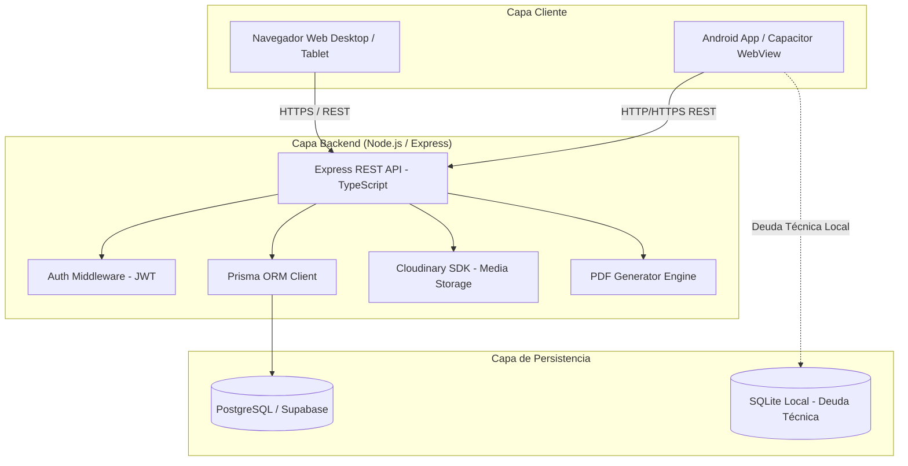
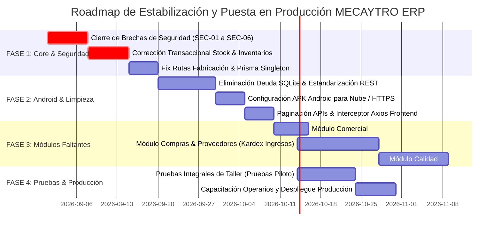

# Catálogo Maestro de Requerimientos y Auditoría Integral de Software
## MECAYTRO ERP / Control MT — Sistema MES & ERP de Manufactura Metalmecánica

> **Documento:** Auditoría Técnica, Funcional, Arquitectónica y Catálogo Maestro de Requerimientos  
> **Sistema:** MECAYTRO ERP (Control MT)  
> **Fecha de Auditoría:** 25 de Agosto de 2026  
> **Elaborado por:** Antigravity Senior Software Architect & MES/ERP Industrial Consultant  
> **Estado:** Documento Base para Estimación de Alcance, Cronograma, Presupuesto y Transformación Digital  

---

## 1. Resumen Ejecutivo

El presente informe constituye la **Auditoría Integral de Código, Arquitectura, Base de Datos, Seguridad, Responsividad y Aplicación Móvil** del sistema **MECAYTRO ERP / Control MT**, una plataforma concebida para la planificación de recursos empresariales (ERP) y la ejecución de manufactura en planta (MES) para la industria metalmecánica y de transformación de lámina y perfiles.

### Diagnóstico General
El sistema cuenta con una base funcional estructurada sobre una arquitectura web moderna (**React 18 + Vite + TailwindCSS** en frontend, **Node.js + Express + TypeScript + Prisma ORM** en backend y **PostgreSQL** como motor relacional primario). Posee módulos operativos relevantes orientados al control de órdenes de trabajo, seguimiento de tareas de planta, catálogo de productos con rutas de fabricación y listas de materiales (BOM), inventario de materia prima, mantenimiento preventivo/correctivo y proyectos especiales de ingeniería.

Sin embargo, la auditoría técnica exhaustiva revela que **el sistema NO se encuentra en condiciones de ser desplegado a producción industrial en su estado actual**. Existen brechas críticas de integridad transaccional, vulnerabilidades severas de seguridad (rutas desprotegidas y endpoint público de registro de usuarios), lógica de negocio inconclusa (reservas de inventario que no se descargan al finalizar órdenes), acoplamiento peligroso entre órdenes de trabajo y catálogos maestros de rutas, inconsistencias en el aplicativo móvil Android Capacitor (dependencia fallida de `localhost` y deuda técnica de un motor SQLite/offline discontinuado), y carencia total de módulos indispensables para la operación formal (Compras/Proveedores, Control de Calidad estandarizado y Cotizaciones Comerciales).

### Cifras Globales de la Auditoría

| Métrica de Auditoría | Valor Detectado |
| :--- | :--- |
| **Módulos Auditados en Código** | **14 Módulos / Dominios** |
| **Total de Funcionalidades Inventariadas** | **84 Funcionalidades** |
| **Funcionalidades IMPLEMENTADAS (100% operativas)** | **31 (36.9%)** |
| **Funcionalidades PARCIALES (incompletas)** | **22 (26.2%)** |
| **Funcionalidades DEFECTUOSAS (con errores de lógica/datos)** | **12 (14.3%)** |
| **Funcionalidades VISUALES (UI sin backend/mock)** | **5 (6.0%)** |
| **Funcionalidades BACKEND ONLY (sin interfaz)** | **2 (2.4%)** |
| **Funcionalidades FRONTEND ONLY (sin endpoint real)** | **2 (2.4%)** |
| **Funcionalidades NO VERIFICADAS** | **4 (4.8%)** |
| **Funcionalidades PENDIENTES CRÍTICAS** | **6 (7.1%)** |
| **Problemas Críticos de Seguridad Detectados** | **6 Hallazgos Críticos** |
| **Deuda Técnica Mayor (SQLite Legacy, N+1, Mock UI)** | **7 Bloques Estructurales** |

---

## 2. Estado Actual del Sistema

El sistema actual es un prototipo avanzado con interfaces ricas y alto valor conceptual para el taller metalmecánico, pero con asimetrías significativas entre la interfaz visible y la persistencia de datos.

### Hallazgos de Implementación Real vs. Aparente:
1. **Desconexión en el Ciclo del Inventario:** Al crear una Orden de Trabajo (OT) se calcula la reserva teórica de materia prima (`stock_reservado`), pero al marcar la orden como `Completada` en el flujo de taller, **el inventario real (`stock_actual`) no se descuenta ni se libera la reserva**, provocando discrepancias irreversibles en el Kardex.
2. **Mutación Destructiva de Catálogos desde Producción:** Al reordenar las tareas de una Orden de Trabajo en el frontend (`reorderTasks`), el backend modifica directamente el número de operación (`no_operacion`) en la tabla maestra `RutaFabricacion` del producto, alterando el diseño de ingeniería del producto para todas las órdenes futuras.
3. **Ausencia de Creación de Clientes:** La pantalla de Clientes permite listar, calificar, editar y asociar productos, pero **no existe botón ni endpoint backend (`createClient`) para registrar un nuevo cliente**.
4. **Kanban de Proyectos Especiales Inerte:** La vista Kanban (`Kanban.tsx`) permite arrastrar tarjetas visualmente, pero contiene un `// TODO: Implement logic to update project phase` y no actualiza el estado de las fases en el servidor.
5. **Componentes Mock Huérfanos:** Existen componentes del Dashboard (`LiveRunsStream.tsx`, `CompliancePulse.tsx`, `CostForecastCard.tsx`) con datos estáticos simulados que no están conectados al flujo operativo.

---

## 3. Arquitectura Tecnológica



### 3.1. Frontend
* **Framework:** React 18.3.1 con TypeScript 5.7.3.
* **Build Tool:** Vite 6.0.7 con plugin `@tailwindcss/vite` (TailwindCSS v4.0.0).
* **Enrutamiento:** React Router DOM v7.1.3 con `DashboardLayout` y rutas protegidas por rol en cliente.
* **Estado Global:** Zustand v5.0.11 (`auth.store.ts`, `config.store.ts`, `orders.store.ts`, `specialProjects.store.ts`).
* **Visualización de Datos:** Recharts v2.15.0 para curvas de producción, KPIs de área y gráficos de torta de OTs.
* **Reportes en Cliente:** jsPDF v2.5.2 y jspdf-autotable v3.8.4 para generación de OTs y reportes mensuales.
* **Manejo de Peticiones:** Axios v1.7.9 con interceptor de Request para inyección de `Bearer Token`. Carencia de interceptor de Response para captura de errores 401/403.

### 3.2. Backend
* **Entorno de Ejecución:** Node.js con Express v5.2.1 escrito en TypeScript 5.9.3 ejecutado mediante `ts-node` / `nodemon`.
* **ORM & Base de Datos:** Prisma ORM v5.22.0 sobre base de datos relacional PostgreSQL (Supabase / Railway).
* **Autenticación:** JSON Web Tokens (`jsonwebtoken` v9.0.3) con hashing de contraseñas mediante `bcryptjs` v3.0.3.
* **Almacenamiento de Archivos:** Cloudinary v2.9.0 para planos, fotos de máquinas, imágenes de productos y evidencias de mantenimiento preventivo.
* **Procesamiento de Archivos:** `multer` v1.4.5 (almacenamiento en memoria buffer) y `xlsx` v0.18.5 para importación masiva de pedidos.

### 3.3. Base de Datos
* **Motor:** PostgreSQL (compatible con Supabase).
* **Modelos Prisma:** 38 modelos relacionales.
* **Integridad:** Claves foráneas definidas, pero carencia de índices en llaves foráneas frecuentes (`orden_trabajo_id`, `personal_id`, `maquina_id`, `producto_id`, `cliente_id`), ausencia de restricciones compuestas de unicidad en listas de materiales (`ListaMateriales`) y ausencia de tipos `enum` nativos en PostgreSQL (todos los estados y roles se almacenan como `String`).

### 3.4. Entorno Móvil (Android / Capacitor)
* **Plataforma:** Capacitor v8.3.1 (`@capacitor/android`, `@capacitor/core`, `@capacitor/cli`).
* **Plugins:** `@capacitor-community/sqlite` v8.1.0.
* **Configuración (`capacitor.config.ts`):** `appId: 'com.controlmt.app'`, `appName: 'Control MT'`, `webDir: 'dist'`.
* **Diagnóstico de Conectividad:** La aplicación móvil presenta un fallo estructural en `api.ts`: al ejecutarse bajo el WebView de Capacitor, `window.location.hostname` retorna `localhost`, forzando la URL base a `http://localhost:3000` (el propio dispositivo móvil), impidiendo la conexión con el servidor en la nube sin configuración manual previa en `localStorage`.

---

## 4. Inventario de Módulos Existentes

El sistema cuenta con 14 módulos identificados en el código fuente:

```
├── 1. Administración & Seguridad (Usuarios, Roles, Configuración Global, Configuración de Usuario)
├── 2. Clientes & Directorio Comercial (Cartera, Calificación, Vinculación de Productos)
├── 3. Catálogo Técnico de Productos & BOM (Fichas Técnicas, Planos PDF, Rutas de Fabricación, BOM)
├── 4. Inventario de Materia Prima (Láminas, Tubos, Kardex de Movimientos, Remisiones Cloudinary)
├── 5. Pedidos de Clientes & Importador Excel (Gestión de OC Cliente, Despachos, Generación Automática de OT)
├── 6. Producción & Órdenes de Trabajo (OTs de Serie, OTs Especiales, Tiempos, Costos, Impresión PDF)
├── 7. Ejecución de Taller & Tareas de Operarios (MES, Control de Tiempos, Registro de Piezas Buenas/Malas)
├── 8. Proyectos Especiales de Ingeniería (Fases, Cargas de Máquina, Piezas, Planos, Notas Técnicas)
├── 9. Maquinaria & Capacidad Instalada (Fichas de Máquina, Horas Acumuladas, Historial de Trabajo)
├── 10. Mantenimiento Preventivo & Correctivo (Planes, Órdenes de Mtto, Reporte de Fallas, MTTR, KPIs)
├── 11. Herramientas & Consumibles (Catálogo de Herramientas, Stock Disponible, Control de Préstamos/Devoluciones)
├── 12. Gestión de Personal & Nómina Operativa (Fichas de Empleados, Horas Extras, Dotaciones EPP)
├── 13. Costos & Finanzas (Resumen Financiero, Costeo por Orden, Costeo de Maquinaria, Costo Hora-Hombre)
└── 14. Dashboard Gerencial & Reportes (KPIs de Planta, Eficiencia OEE simplificada, Producción Semanal, Reporte Mensual PDF)
```

---

## 5. Matriz Maestra de Funcionalidades

A continuación se detalla la matriz completa de auditoría técnica y funcional verificada sobre el código fuente del proyecto:

| ID | Módulo | Submódulo | Funcionalidad | Descripción Técnica y Operativa | Estado | Prioridad | Frontend | Backend | BD | Android | Observaciones de Auditoría |
| :--- | :--- | :--- | :--- | :--- | :--- | :--- | :--- | :--- | :--- | :--- | :--- |
| **ADM-001** | Administración | Autenticación | Login con JWT | Inicio de sesión con validación de credenciales en bcrypt y generación de JWT de 24h. | **IMPLEMENTADA** | **CRÍTICA** | Sí | Sí | Sí | Parcial | Funciona en web. En Android falla si no se configura URL base manual. |
| **ADM-002** | Administración | Autenticación | Registro Público | Endpoint público `POST /api/auth/register` sin autenticación ni validación de rol admin. | **DEFECTUOSA** | **CRÍTICA** | No | Sí | Sí | No aplica | **Vulnerabilidad Crítica:** Cualquier persona puede crear usuarios Administradores vía API abierta. |
| **ADM-003** | Administración | Usuarios | CRUD de Usuarios | Creación, actualización de roles, cambio de password y desactivación de usuarios. | **IMPLEMENTADA** | **ALTA** | Sí | Sí | Sí | Sí | Funciona correctamente desde `UsersPage.tsx` con permisos de Administrador. |
| **ADM-004** | Administración | Permisos | Control de Roles | Middleware `authorizeRole` en endpoints clave y filtrado de menús en `DashboardLayout`. | **PARCIAL** | **CRÍTICA** | Sí | Parcial | No | Parcial | Varias rutas críticas del backend no tienen aplicado el middleware de seguridad. |
| **ADM-005** | Administración | Configuración | Parámetros Globales | Configuración de NIT, razón social, densidades de acero, decimales y umbrales de stock. | **DEFECTUOSA** | **ALTA** | Sí | Sí | Sí | Sí | Los endpoints `GET /api/settings` y `PUT /api/settings` no requieren token de autenticación. |
| **ADM-006** | Administración | Configuración | Preferencias de Usuario | Configuración de tema visual (Claro/Oscuro), paleta de colores HSL y preferencias de alerta. | **IMPLEMENTADA** | **MEDIA** | Sí | Sí | Sí | Sí | Se persiste en `ConfiguracionUsuario` y en `localStorage`. |
| **CLI-001** | Comercial | Clientes | Listado y Búsqueda | Consulta y filtrado en tiempo real de cartera de clientes con conteo de productos asociados. | **IMPLEMENTADA** | **ALTA** | Sí | Sí | Sí | Sí | Endpoint `GET /api/clients` optimizado con `_count`. |
| **CLI-002** | Comercial | Clientes | Creación de Cliente | Formulario para ingresar nuevos clientes a la base de datos. | **PENDIENTE** | **ALTA** | No | No | Sí | No | **Inexistente:** No hay botón en UI ni endpoint `POST /api/clients` en backend. |
| **CLI-003** | Comercial | Clientes | Edición de Cliente | Modificación de nombre, dirección física y datos de contacto del cliente. | **IMPLEMENTADA** | **ALTA** | Sí | Sí | Sí | Sí | Endpoint `PUT /api/clients/:id` operativo. |
| **CLI-004** | Comercial | Clientes | Calificación de Cliente | Asignación de rating de 1 a 5 estrellas para priorización comercial. | **IMPLEMENTADA** | **BAJA** | Sí | Sí | Sí | Sí | Endpoint `PATCH /api/clients/:id/rating` con modal interactivo. |
| **CLI-005** | Comercial | Clientes | Eliminación / Soft Delete | Borrado físico si no tiene historial o marcado inactivo si posee OTs o productos. | **IMPLEMENTADA** | **ALTA** | Sí | Sí | Sí | Sí | Lógica de protección relacional implementada en `deleteClient`. |
| **CLI-006** | Comercial | Clientes | Vinculación de Productos | Modal masivo para vincular o desvincular productos del catálogo al cliente. | **IMPLEMENTADA** | **MEDIA** | Sí | Sí | Sí | Sí | Endpoints `bindProducts` y `unbindProducts` operativos. |
| **PED-001** | Comercial | Pedidos | Listado y Filtros | Visualización de pedidos de clientes con filtros por estado, cliente y búsqueda de OC. | **IMPLEMENTADA** | **ALTA** | Sí | Sí | Sí | Sí | Endpoint `GET /api/pedidos` funcional. Sin autenticación en ruta. |
| **PED-002** | Comercial | Pedidos | Creación Manual | Registro de pedidos con cálculo automático de saldos e importes monetarios. | **IMPLEMENTADA** | **ALTA** | Sí | Sí | Sí | Sí | Endpoint `POST /api/pedidos` enlaza automáticamente SKU existente. |
| **PED-003** | Comercial | Pedidos | Importación Excel | Carga masiva de pedidos desde archivos `.xlsx` con parseo de fechas en español. | **IMPLEMENTADA** | **ALTA** | Sí | Sí | Sí | No | Funciona en web mediante `xlsx` y `multer`. |
| **PED-004** | Comercial | Pedidos | Generación de OT desde Pedido | Creación automática de OT de serie, herencia de BOM/Ruta y reserva de materia prima. | **PARCIAL** | **CRÍTICA** | Sí | Sí | Sí | Sí | Funciona pero no valida si la OT generada previamente ya cubrió la cantidad. |
| **PED-005** | Comercial | Pedidos | Sincronización de Estados | Actualización automática de estados según despachos, stock e inventario terminado. | **IMPLEMENTADA** | **MEDIA** | Sí | Sí | Sí | Sí | Endpoint `POST /api/pedidos/sync` recalcula estados de toda la cartera. |
| **PRD-001** | Ingeniería | Productos | Catálogo Maestro | Visualización en tarjetas del catálogo de piezas producidas, fotos y estado activo. | **IMPLEMENTADA** | **ALTA** | Sí | Sí | Sí | Sí | Endpoint `GET /api/products` optimizado con `select` específico. |
| **PRD-002** | Ingeniería | Productos | Ficha Técnica y Planos | Carga y visualización de planos en PDF e imágenes técnicas hacia Cloudinary. | **IMPLEMENTADA** | **ALTA** | Sí | Sí | Sí | Sí | Endpoints `uploadProductImage` y `uploadProductPDF` operativos. |
| **PRD-003** | Ingeniería | Productos | Lista de Materiales (BOM) | Definición de materias primas y cantidades unitarias requeridas por producto. | **IMPLEMENTADA** | **CRÍTICA** | Sí | Sí | Sí | Sí | Se actualiza atómicamente mediante transacciones en `updateProduct`. |
| **PRD-004** | Ingeniería | Productos | Rutas de Fabricación | Definición secuencial de operaciones, centros de trabajo y tiempos estándar. | **IMPLEMENTADA** | **CRÍTICA** | Sí | Sí | Sí | Sí | Soporta soft-delete de operaciones en uso en `updateProductRoutes`. |
| **PRD-005** | Ingeniería | Productos | Cálculo de Piezas por Lámina | Configuración de aprovechamiento de lámina 4x8 y 2x1 con cálculo de ancho de tira. | **IMPLEMENTADA** | **MEDIA** | Sí | Sí | Sí | Sí | Utilizado luego por el motor de órdenes de trabajo. |
| **PRD-006** | Ingeniería | Productos | Ajuste de Stock de Producto Terminado | Entrada y salida manual de piezas terminadas con registro en `MovimientoProducto`. | **IMPLEMENTADA** | **ALTA** | Sí | Sí | Sí | Sí | Endpoint `POST /api/products/:id/stock` con control transaccional. |
| **INV-001** | Inventarios | Materia Prima | Listado de Stock MP | Control de láminas, calibres, dimensiones físicas, peso teórico y stock disponible. | **IMPLEMENTADA** | **CRÍTICA** | Sí | Sí | Sí | Parcial | En Android el repositorio intenta consultar SQLite local si es nativo. |
| **INV-002** | Inventarios | Materia Prima | Creación de Material | Registro de nuevo material con densidades y cálculo de peso unitario. | **IMPLEMENTADA** | **ALTA** | Sí | Sí | Sí | Parcial | Endpoint `POST /api/inventory` operativo. |
| **INV-003** | Inventarios | Materia Prima | Entrada por Compra con Remisión | Ingreso de stock físico vinculando foto de remisión del proveedor en Cloudinary. | **IMPLEMENTADA** | **ALTA** | Sí | Sí | Sí | Sí | Endpoint `POST /api/inventory/:id/add-stock` transaccional. |
| **INV-004** | Inventarios | Materia Prima | Ajuste Manual de Stock | Corrección manual de inventario con motivo y referencia de auditoría. | **IMPLEMENTADA** | **ALTA** | Sí | Sí | Sí | Sí | Endpoint `POST /api/inventory/:id/adjust-stock`. |
| **INV-005** | Inventarios | Materia Prima | Kardex de Movimientos | Historial cronológico de ingresos, salidas, ajustes y reservas de cada material. | **IMPLEMENTADA** | **CRÍTICA** | Sí | Sí | Sí | Sí | Endpoint `GET /api/inventory/:id/movements`. Carencia de paginación. |
| **INV-006** | Inventarios | Materia Prima | Reversión de Movimientos | Anulación de un movimiento erróneo con restauración de stock compensatoria. | **IMPLEMENTADA** | **MEDIA** | Sí | Sí | Sí | Sí | Endpoint `POST /api/inventory/movements/:id/reverse`. |
| **INV-007** | Inventarios | Materia Prima | Eliminación de Material | Borrado de materiales obsoletos en el inventario. | **PENDIENTE** | **MEDIA** | No | No | Sí | No | No existe endpoint `DELETE` en backend ni acción en frontend. |
| **PROD-001** | Producción | Órdenes de Trabajo | Creación OT Producción Serie | Creación de OT validando stock, generando tareas de ruta y reservando láminas. | **PARCIAL** | **CRÍTICA** | Sí | Sí | Sí | Parcial | Reserva láminas calculadas (`stock_reservado`), pero no descuenta stock al finalizar. |
| **PROD-002** | Producción | Órdenes de Trabajo | Creación OT Proyecto Especial | Creación de OT sin producto previo, asignando operaciones desde el catálogo general. | **IMPLEMENTADA** | **ALTA** | Sí | Sí | Sí | Parcial | Crea producto temporal `PROJ-OT-xxx` y genera tareas asociadas. |
| **PROD-003** | Producción | Órdenes de Trabajo | Listado y Filtros de OTs | Visualización de OTs con filtros por estado, cliente y prioridad. | **IMPLEMENTADA** | **ALTA** | Sí | Sí | Sí | Parcial | En Android consulta SQLite si está en modo nativo (`ordenTrabajoRepository`). |
| **PROD-004** | Producción | Órdenes de Trabajo | Detalle Integral de OT | Vista técnica con desglose de tareas, operarios, máquinas, materiales y avances. | **IMPLEMENTADA** | **CRÍTICA** | Sí | Sí | Sí | Sí | Endpoint `GET /api/orders/:id/details` exhaustivo. |
| **PROD-005** | Producción | Órdenes de Trabajo | Cierre / Finalización de OT | Cambio de estado a `Completada` y actualización de horas de máquina. | **DEFECTUOSA** | **CRÍTICA** | Sí | Sí | Sí | Sí | **Falla Crítica:** No descuenta `stock_actual` ni limpia `stock_reservado` de MP. |
| **PROD-006** | Producción | Órdenes de Trabajo | Cancelación de OT | Cancelación de orden en curso y liberación de recursos. | **DEFECTUOSA** | **CRÍTICA** | Sí | Sí | Sí | Sí | **Falla:** Al cambiar estado a `Cancelada`, no libera las reservas en `MateriaPrima`. |
| **PROD-007** | Producción | Órdenes de Trabajo | Duplicación de OT | Creación rápida de una nueva orden a partir de los datos técnicos de una existente. | **IMPLEMENTADA** | **BAJA** | Sí | Sí | Sí | Sí | Endpoint `POST /api/orders/:id/duplicate` funcional. |
| **PROD-008** | Producción | Órdenes de Trabajo | Eliminación de OT | Borrado en cascada de OT, tareas, materiales y reversión de reservas de stock. | **IMPLEMENTADA** | **ALTA** | Sí | Sí | Sí | Sí | Endpoint `DELETE /api/orders/:id` transaccional con reversión de reservas. |
| **PROD-009** | Producción | Órdenes de Trabajo | Generación de Ficha PDF | Exportación de ficha técnica de taller con código de barras simulado y logo. | **IMPLEMENTADA** | **ALTA** | Sí | Sí | No | Parcial | Implementado en frontend mediante `jsPDF` (`pdfGenerator.ts`). |
| **TSK-001** | Producción | MES / Tareas | Tablero de Operarios | Vista personalizada de tareas asignadas para operadores y supervisores. | **IMPLEMENTADA** | **CRÍTICA** | Sí | Sí | Sí | Parcial | Filtros por operario, estado, prioridad y fecha operativa. |
| **TSK-002** | Producción | MES / Tareas | Asignación de Tareas | Asignación de operario, máquina, fecha programada y tiempo estimado a la tarea. | **IMPLEMENTADA** | **ALTA** | Sí | Sí | Sí | Sí | Endpoint `PUT /api/tasks/:id/assign`. |
| **TSK-003** | Producción | MES / Tareas | Inicio de Tarea (Cronómetro) | Registro de timestamp de inicio de operación y cambio automático de estado de OT. | **IMPLEMENTADA** | **CRÍTICA** | Sí | Sí | Sí | Sí | Endpoint `POST /api/tasks/:id/start`. |
| **TSK-004** | Producción | MES / Tareas | Finalización y Registro de Calidad | Cierre de tarea con piezas buenas, malas (scrap), paradas y cálculo de costo real. | **IMPLEMENTADA** | **CRÍTICA** | Sí | Sí | Sí | Sí | Endpoint `POST /api/tasks/:id/finish` calcula costo hora según catálogo. |
| **TSK-005** | Producción | MES / Tareas | Reordenamiento de Tareas | Cambio de secuencia de tareas arrastrando en la tabla de operaciones. | **DEFECTUOSA** | **CRÍTICA** | Sí | Sí | Sí | Sí | **Falla de Arquitectura:** Modifica `RutaFabricacion` global del producto maestro. |
| **TSK-006** | Producción | MES / Tareas | Edición Manual de Tiempos | Ajuste de tiempos, fechas y piezas reportadas por supervisión. | **IMPLEMENTADA** | **ALTA** | Sí | Sí | Sí | Sí | Endpoint `PUT /api/tasks/:id/update-details`. |
| **ESP-001** | Ingeniería | Proyectos Especiales | Dashboard de Proyectos | Métricas de proyectos activos, en riesgo, horas acumuladas y avance global. | **IMPLEMENTADA** | **ALTA** | Sí | Sí | Sí | Sí | Integrado en `special-projects/Dashboard.tsx`. |
| **ESP-002** | Ingeniería | Proyectos Especiales | Ficha y Registro de Proyecto | Alta de proyectos con carga de planos PDF, fotos y validación de límite máximo. | **IMPLEMENTADA** | **ALTA** | Sí | Sí | Sí | Sí | Valida `max_proyectos_activos` configurado globalmente. |
| **ESP-003** | Ingeniería | Proyectos Especiales | Gestión de Fases | Control de las 7 fases estándar (Diseño, Materiales, Programación, etc.). | **IMPLEMENTADA** | **ALTA** | Sí | Sí | Sí | Sí | Endpoints para agregar, editar y eliminar fases por proyecto. |
| **ESP-004** | Ingeniería | Proyectos Especiales | Kanban de Fases | Tablero visual tipo Kanban para mover proyectos entre etapas de proceso. | **VISUAL** | **MEDIA** | Sí | No | Sí | Sí | **Solo Visual:** Arrastrar tarjetas no guarda el cambio de fase en el servidor. |
| **ESP-005** | Ingeniería | Proyectos Especiales | Control de Piezas y Planos | Desglose de piezas individuales del ensamble con 2 planos por pieza y avances. | **IMPLEMENTADA** | **ALTA** | Sí | Sí | Sí | Sí | Endpoints de subida de planos y registro de avance por pieza. |
| **ESP-006** | Ingeniería | Proyectos Especiales | Lista de Materiales Requeridos | Registro de perfiles, placas y consumibles específicos del proyecto especial. | **IMPLEMENTADA** | **ALTA** | Sí | Sí | Sí | Sí | Endpoint `PUT /api/special-projects/:id/materials`. |
| **ESP-007** | Ingeniería | Proyectos Especiales | Bitácora y Notas Técnicas | Muro de anotaciones técnicas e incidencias cronológicas del proyecto. | **IMPLEMENTADA** | **MEDIA** | Sí | Sí | Sí | Sí | Endpoint `POST /api/special-projects/:id/notes`. |
| **ESP-008** | Ingeniería | Proyectos Especiales | Reporte PDF de Proyecto | Generación de orden y ficha completa de proyecto especial en PDF desde backend. | **IMPLEMENTADA** | **MEDIA** | Sí | Sí | No | Sí | Implementado en backend con `PDFKit` (`generateSpecialProjectPDF`). |
| **MAC-001** | Mantenimiento | Maquinaria | Catálogo de Máquinas | Registro de tornos, fresadoras, prensas, potencia HP, consumo y foto. | **IMPLEMENTADA** | **ALTA** | Sí | Sí | Sí | Sí | Endpoint `GET /api/machines` con categorización automática de área. |
| **MAC-002** | Mantenimiento | Maquinaria | Carga de Máquina por Semana | Visualización de horas asignadas vs. capacidad semanal por equipo. | **IMPLEMENTADA** | **ALTA** | Sí | Sí | Sí | Sí | Endpoint `GET /api/machines/load` basado en `CargaMaquina`. |
| **MAC-003** | Mantenimiento | Maquinaria | Historial de Trabajo en OT | Trazabilidad de todas las órdenes y operarios que han operado cada equipo. | **IMPLEMENTADA** | **MEDIA** | Sí | Sí | Sí | Sí | Endpoint `GET /api/machines/:id/work-history`. |
| **MAC-004** | Mantenimiento | Maquinaria | Procesos y Productos Habituales | Matriz de tiempos estándar y procesos que cada máquina realiza por producto. | **IMPLEMENTADA** | **MEDIA** | Sí | Sí | Sí | Sí | Basado en modelo `ProductoMaquinaProceso`. |
| **MNT-001** | Mantenimiento | Preventivo | Planes de Mantenimiento | Creación de rutinas de lubricación, ajuste o revisión por frecuencia en días. | **IMPLEMENTADA** | **ALTA** | Sí | Sí | Sí | Sí | Endpoint `POST /api/maintenance/plans`. |
| **MNT-002** | Mantenimiento | Preventivo | Programación de Mantenimiento | Agendamiento de órdenes de servicio preventivo con fecha y técnico asignado. | **IMPLEMENTADA** | **ALTA** | Sí | Sí | Sí | Sí | Endpoint `POST /api/maintenance/schedule`. |
| **MNT-003** | Mantenimiento | Preventivo | Ejecución y Cierre Preventivo | Registro de actividades, costos y carga de hasta 5 fotos de evidencia en Cloudinary. | **IMPLEMENTADA** | **ALTA** | Sí | Sí | Sí | Sí | Endpoints `completeMaintenance` y `uploadMaintenanceImages`. |
| **MNT-004** | Mantenimiento | Correctivo | Reporte de Fallas de Planta | Registro de averías por operarios; cambia automáticamente el estado del equipo a Fuera de Servicio. | **IMPLEMENTADA** | **CRÍTICA** | Sí | Sí | Sí | Sí | Endpoint `POST /api/maintenance/reportes-fallas`. |
| **MNT-005** | Mantenimiento | Correctivo | Orden de Mantenimiento (OM) | Apertura y seguimiento de la orden correctiva asociada o no a una falla. | **IMPLEMENTADA** | **ALTA** | Sí | Sí | Sí | Sí | Endpoint `POST /api/maintenance/ordenes-mantenimiento`. |
| **MNT-006** | Mantenimiento | Correctivo | Cierre de OM y Restablecimiento | Cierre con tiempo muerto (horas), repuestos, costo y restablecimiento a Operativa. | **IMPLEMENTADA** | **CRÍTICA** | Sí | Sí | Sí | Sí | Endpoint `PUT /api/maintenance/ordenes-mantenimiento/:id/close`. |
| **MNT-007** | Mantenimiento | Indicadores | KPIs de Mantenimiento (MTTR) | Cálculo de Tiempo Medio de Reparación (MTTR), tiempo de inactividad y fallas pendientes. | **IMPLEMENTADA** | **ALTA** | Sí | Sí | Sí | Sí | Endpoint `GET /api/maintenance/kpis`. |
| **TLS-001** | Herramientas | Catálogo | Inventario de Herramientas | Control de insertos, brocas, calibradores, cantidades totales y disponibles. | **IMPLEMENTADA** | **ALTA** | Sí | Sí | Sí | Sí | Endpoint `GET /api/tools` con control de estado (DISPONIBLE, EN USO). |
| **TLS-002** | Herramientas | Préstamos | Registro de Préstamo a Operario | Asignación de herramienta a un trabajador y descuento automático de stock disponible. | **IMPLEMENTADA** | **ALTA** | Sí | Sí | Sí | Sí | Endpoint `POST /api/loans/lend` transaccional. |
| **TLS-003** | Herramientas | Préstamos | Devolución de Herramienta | Registro de retorno de herramienta y restitución de stock disponible en almacén. | **DEFECTUOSA** | **ALTA** | Sí | Sí | Sí | Sí | **Riesgo:** El update de inventario está en un catch silenciado (`ignorando...`) sin rollback. |
| **PER-001** | Personal | Empleados | Maestro de Personal | Ficha del trabajador con salario, prestaciones, recargos y costo hora-hombre. | **IMPLEMENTADA** | **ALTA** | Sí | Sí | Sí | Sí | Endpoint `GET /api/personal` y `POST /api/personal`. |
| **PER-002** | Personal | Empleados | Eliminación de Personal | Borrado físico de empleados en base de datos. | **DEFECTUOSA** | **MEDIA** | Sí | Sí | Sí | Sí | **Falla:** Falla por integridad referencial si el empleado tiene tareas o préstamos asociados. |
| **PER-003** | Personal | Tiempo / Nómina | Registro de Horas Extras Masivas | Carga masiva de horas diurnas, nocturnas y festivas con cálculo de costo total. | **IMPLEMENTADA** | **ALTA** | Sí | Sí | Sí | Sí | Endpoint `POST /api/personal/bulk-overtime` transaccional. |
| **PER-004** | Personal | Tiempo / Nómina | Control de Pagos de Horas Extras | Switch para marcar horas extras como pagadas o pendientes de liquidación. | **IMPLEMENTADA** | **MEDIA** | Sí | Sí | Sí | Sí | Endpoint `PATCH /api/personal/time-log/:logId/toggle-payment`. |
| **PER-005** | Personal | EPP / Dotaciones | Entrega de Dotaciones | Registro y control de entrega de implementos de seguridad y dotación de ropa. | **IMPLEMENTADA** | **MEDIA** | Sí | Sí | Sí | Sí | Endpoint `POST /api/personal/:id/dotacion`. |
| **FIN-001** | Finanzas | Rentabilidad | Resumen Financiero Global | Cálculo de ingresos teóricos, costos de materias primas, nómina y rentabilidad. | **DEFECTUOSA** | **ALTA** | Sí | Sí | Sí | Sí | **Falla:** Suma inventario en almacén (activo) como gasto del periodo y no filtra por fechas. |
| **FIN-002** | Finanzas | Costeo | Costos por Orden de Trabajo | Desglose de costo de materia prima, mano de obra, ingresos y margen bruto por OT. | **IMPLEMENTADA** | **ALTA** | Sí | Sí | Sí | Sí | Endpoint `GET /api/finances/orders`. |
| **FIN-003** | Finanzas | Costeo | Costos Operativos de Maquinaria | Costo de horas operativas, mantenimiento y depreciación mensual por equipo. | **IMPLEMENTADA** | **MEDIA** | Sí | Sí | Sí | Sí | Endpoint `GET /api/finances/machines`. |
| **FIN-004** | Finanzas | Costeo | Costo Hora-Hombre Real | Cálculo de horas productivas reportadas vs. nómina total devengada por operario. | **IMPLEMENTADA** | **ALTA** | Sí | Sí | Sí | Sí | Endpoint `GET /api/finances/personal`. |
| **DSH-001** | Dashboard | Gerencial | Métricas de Planta en Tiempo Real | OTs activas, pendientes, eficiencia promedio, operarios activos y costo del mes. | **IMPLEMENTADA** | **ALTA** | Sí | Sí | Sí | Sí | Endpoint `GET /api/dashboard/stats` con filtrado dinámico por área productiva. |
| **DSH-002** | Dashboard | Gerencial | Gráfica de Producción Semanal | Curva de tendencia de piezas producidas en los últimos 7 días. | **IMPLEMENTADA** | **ALTA** | Sí | Sí | Sí | Sí | Renderizado mediante Recharts en `Dashboard.tsx`. |
| **DSH-003** | Dashboard | Gerencial | Distribución de OTs por Estado | Gráfico de torta con proporciones de órdenes terminadas, activas y pendientes. | **IMPLEMENTADA** | **MEDIA** | Sí | Sí | Sí | Sí | Gráfico interactivo con paleta de estados. |
| **DSH-004** | Dashboard | Gerencial | Comparativo por Área Productiva | Rendimiento cruzado entre Tornos, Mecanizado, Soldadura y Troquelería. | **IMPLEMENTADA** | **ALTA** | Sí | Sí | Sí | Sí | BarChart comparativo de piezas y órdenes por centro productivo. |
| **DSH-005** | Dashboard | Reportes | Reporte Mensual Gerencial | Modal interactivo para balance mensual con ranking de operarios y exportación PDF. | **IMPLEMENTADA** | **ALTA** | Sí | Sí | Sí | Sí | Componente `MonthlyReportModal.tsx` con exportación en PDF y Excel. |
| **DSH-006** | Dashboard | Componentes | Flujo de Ejecución en Vivo | Componente de streaming visual de tareas en ejecución. | **VISUAL** | **BAJA** | Sí | No | No | Sí | `LiveRunsStream.tsx` utiliza un arreglo estático de datos mock (`mockRuns`). |
| **DSH-007** | Dashboard | Componentes | Tarjetas de Pronóstico y Pulso | Indicadores de cumplimiento de normativas y pronóstico de costos. | **VISUAL** | **BAJA** | Sí | No | No | Sí | `CompliancePulse.tsx` y `CostForecastCard.tsx` no tienen enlace a endpoints reales. |
| **AND-001** | Android | Conectividad | Conexión Nativa a Backend en la Nube | Conexión del APK a la API REST central mediante Internet. | **DEFECTUOSA** | **CRÍTICA** | Sí | Sí | Sí | Parcial | `api.ts` resuelve a `localhost:3000` en Android por defecto. |
| **AND-002** | Android | Offline Legacy | Motor SQLite Local Discontinuado | Servicios y repositorios que intentan consultar SQLite local en entorno nativo. | **DEFECTUOSA** | **CRÍTICA** | Sí | No | No | Sí | **Deuda Técnica Crítica:** 4 repositorios bifurcan la lógica hacia SQLite local. |
| **AND-003** | Android | Sincronización | Endpoints de Push/Pull Legacy | Endpoints `/api/sync/push` y `/api/sync/pull` sin autenticación para sync offline. | **DEFECTUOSA** | **CRÍTICA** | No | Sí | Sí | No aplica | Endpoints abiertos que permiten inyectar o extraer registros crudos sin token. |
| **AND-004** | Android | Seguridad | Configuración de Red (Cleartext) | Configuración de red en AndroidManifest y network_security_config. | **DEFECTUOSA** | **ALTA** | No aplica | No aplica | No aplica | Sí | IP privada `192.168.2.18` hardcodeada y `usesCleartextTraffic=true`. |

---

## 6. Funcionalidades Pendientes y Brechas Funcionales

Para que MECAYTRO cuente con un sistema integral y funcional en su planta, se han identificado las siguientes ausencias que requieren desarrollo formal:

### 6.1. Módulo Comercial
* **CLI-002 (Crear Nuevo Cliente):** Implementación de formulario modal y endpoint `POST /api/clients` con validación de NIT/cédula única.
* **COM-COT (Cotizador Técnico y Presupuestos):** Módulo para presupuestar piezas calculando peso de lámina, horas de máquina, tiempos de preparación (setup) y margen de utilidad antes de emitir un pedido formal.

### 6.2. Módulo de Inventarios y Abastecimiento
* **INV-007 (Eliminación / Inactivación de Materiales):** Endpoint `DELETE /api/inventory/:id` con validación de historial en BOMs y movimientos.
* **INV-LOC (Control de Ubicaciones Físicas de Almacén):** Mapeo de estantes, bodegas y racks para materias primas y producto terminado.
* **PUR-SUP (Módulo de Proveedores y Órdenes de Compra):** Catálogo de proveedores, cotizaciones de compra, órdenes de compra y recepción de insumos con enlace automático al Kardex de materia prima.

### 6.3. Módulo de Producción y MES
* **PRD-DISP (Motor de Programación y Despacho de Planta):** Algoritmo de secuenciación de órdenes según fecha de entrega y disponibilidad de máquinas (Gantt de producción).
* **PRD-SCRAP (Gestión Avanzada de Mermas y Retales):** Registro y reincorporación al inventario de sobrantes útiles de lámina (retales) generados en troquelado y corte.

### 6.4. Módulo de Calidad
* **QLT-INS (Inspección de Primer Pieza y Control en Proceso):** Formularios de liberación de primera pieza con tolerancias dimensionales e instrumentos de medición (calibrador, micrómetro).
* **QLT-NCR (No Conformidades y Acciones Correctivas):** Registro formal de piezas defectuosas con causa raíz (humana, material, máquina, método) y plan de acción.

---

## 7. Problemas Técnicos Identificados

### 7.1. Transaccionalidad Rota en Producción e Inventarios
* **Problema:** En `orders.controller.ts` (`updateOrderStatus`), al marcar una OT como `Completada`, la transacción actualiza las horas acumuladas de la máquina pero **omite el descuento de `stock_actual` y la liberación de `stock_reservado`**.
* **Impacto Operativo:** El inventario teórico de láminas se desincroniza del inventario físico en el primer día de uso en planta.

### 7.2. Corrupción de Catálogo Maestro por Reordenamiento de Tareas
* **Problema:** En `tasks.controller.ts` (`reorderTasks`), la función actualiza `no_operacion` en la tabla `RutaFabricacion`.
* **Impacto:** Si un supervisor altera el orden de las operaciones para una orden particular (por ejemplo, para adelantar soldadura antes de pintura), el producto base queda alterado en ingeniería para todas las órdenes que se creen en el futuro.

### 7.3. Doble Instancia de Prisma Client (Memory / Connection Leak)
* **Problema:** `specialProjects.controller.ts` declara `const prisma = new PrismaClient();` en lugar de reutilizar la instancia singleton de `../prisma.ts`.
* **Impacto:** En entornos con múltiples usuarios concurrentes (o bajo serverless), se satura el pool de conexiones de PostgreSQL en Supabase.

### 7.4. Consulta Inválida en Dashboard Stats
* **Problema:** En `dashboard.controller.ts` (línea 97):
  ```typescript
  stock_actual: { lte: prisma.materiaPrima.fields.punto_reorden }
  ```
  `prisma.materiaPrima.fields` no es evaluable como valor escalar en consultas dinámicas de Prisma Client en PostgreSQL, produciendo alertas de stock erróneas o excepciones en tiempo de ejecución.

### 7.5. Comparación Financiera Inconsistente
* **Problema:** En `finances.controller.ts` (`getFinancialSummary`), se suma el valor de todo el inventario existente en bodega como si fuera un costo devengado del mes, y se calculan ingresos históricos acumulados de toda la vida del sistema sin acotar por rango de fechas.

---

## 8. Deuda Técnica

### 8.1. Deuda de Arquitectura SQLite / Offline en Android
* **Ubicación:** `frontend/src/services/databaseService.ts`, `syncService.ts`, `syncQueueService.ts` y repositorios en `frontend/src/repositories/`.
* **Detalle:** El sistema conserva 4 repositorios locales (`ordenTrabajoRepository.ts`, `materiaPrimaRepository.ts`, `inventarioRepository.ts`, `taskRepository.ts`) que verifican `Capacitor.isNativePlatform()`. Si es nativo, ejecutan queries SQL directas contra un SQLite local desactualizado.
* **Consecuencia:** En teléfonos móviles Android, pantallas como Inventario y Órdenes intentan leer una base de datos local vacía en lugar de consumir las APIs del servidor PostgreSQL, mientras que pantallas como Clientes y Mantenimiento sí consumen HTTP, provocando un comportamiento errático y fragmentado.
* **Solución Requerida:** Estandarizar todos los repositorios y servicios a consumo exclusivo de API REST sobre HTTPS conectado a PostgreSQL.

### 8.2. Deuda de Manejo de Errores Globales y Autenticación en Frontend
* **Detalle:** `axios` posee interceptor para agregar el Bearer Token en `auth.store.ts`, pero carece de interceptor de respuesta. Cuando un token expira o es revocado (HTTP 401/403), la interfaz no redirige a `/login` ni limpia `localStorage`, dejando la aplicación en estado de carga infinita.

### 8.3. Componentes Visuales Mock Huérfanos
* **Ubicación:** `frontend/src/components/dashboard/LiveRunsStream.tsx`, `CompliancePulse.tsx`, `CostForecastCard.tsx`, `GettingStartedCard.tsx`, `KpiCard.tsx`.
* **Detalle:** Componentes copiados de plantillas que no tienen integración con el modelo de datos de MECAYTRO.

---

## 9. Auditoría de Base de Datos (PostgreSQL / Prisma)

### 9.1. Esquema Actual
* **Modelos Identificados:** 38 tablas en `schema.prisma`.
* **Tipos de Datos:** Uso extensivo de `Decimal` para cantidades y dinero, y `String` para estados, roles y categorías.

### 9.2. Hallazgos y Vulnerabilidades de Integridad
1. **Ausencia de Índices en Claves Foráneas Críticas:**
   * Las tablas con alto volumen transaccional como `TareaProduccion` (`orden_trabajo_id`, `personal_id`, `maquina_id`), `MovimientoInventarioMP` (`materia_prima_id`, `orden_trabajo_id`), y `MovimientoProducto` carecen de índices explícitos (`@@index`), lo cual degradará severamente el rendimiento de las consultas y reportes a medida que aumente el historial de planta.
2. **Falta de Restricciones Únicas Compuestas:**
   * En `ListaMateriales`, no existe `@@unique([producto_id, materia_prima_id])`. Es posible registrar múltiples filas con el mismo material para un mismo producto.
   * En `RutaFabricacion`, no existe `@@unique([producto_id, no_operacion])`.
3. **Falta de Enums Tipados:**
   * Estados de órdenes (`Pendiente`, `En Progreso`, `Completada`, `Cancelada`) y roles de usuario se manejan como cadenas de texto libres, permitiendo inconsistencias por diferencias de mayúsculas/minúsculas o errores tipográficos.
4. **Campos Huérfanos en Tablas de Soporte:**
   * El modelo `Alerta` contiene `proyecto_id` y `maquina_id` como enteros planos sin relación foránea `@relation`.
   * El modelo `Cliente` no posee campos para identificación tributaria (NIT/RUT), número de teléfono ni correo electrónico.

---

## 10. Auditoría de Seguridad

| ID Hallazgo | Componente | Descripción del Riesgo | Nivel de Riesgo | Acción Correctiva Obligatoria |
| :--- | :--- | :--- | :--- | :--- |
| **SEC-01** | `auth.routes.ts` | Endpoint público `POST /api/auth/register` permite a cualquier usuario anónimo crear cuentas con rol `Administrador`. | **CRÍTICO** | Eliminar ruta pública de registro; la creación de usuarios debe ser exclusiva de administradores autenticados (`users.routes.ts`). |
| **SEC-02** | `sync.routes.ts` | Endpoints `POST /api/sync/push` y `GET /api/sync/pull` no requieren autenticación y permiten inyectar o extraer datos crudos de la base de datos. | **CRÍTICO** | Proteger o eliminar endpoints legacy de sincronización. |
| **SEC-03** | `settings.routes.ts` | Endpoints `GET /api/settings` y `PUT /api/settings` no tienen middleware de autenticación, permitiendo alterar parámetros globales de la empresa. | **ALTO** | Aplicar `authenticateToken` y `authorizeRole(['Administrador'])`. |
| **SEC-04** | `pedidos.routes.ts` | Rutas de pedidos (`POST /import`, `POST /:id/generate-ot`, etc.) no tienen aplicado `authenticateToken`. | **ALTO** | Proteger todas las rutas de pedidos con middleware JWT. |
| **SEC-05** | `server.ts` | Fallback de JWT Secret: Si `JWT_SECRET` no está en `.env`, se usa `'fallback-secret-for-dev-only'`, permitiendo forjar tokens. | **ALTO** | Interrumpir el inicio del servidor (`process.exit(1)`) si falta `JWT_SECRET` en producción. |
| **SEC-06** | `server.ts` (CORS) | Configuración permisiva de orígenes (`origin.endsWith('.vercel.app')`) permite peticiones desde cualquier proyecto desplegado en Vercel. | **MEDIO** | Restringir el arreglo de CORS exclusivamente a los dominios autorizados de MECAYTRO. |

---

## 11. Auditoría de Aplicación Android (Capacitor)

### 11.1. Arquitectura de Conectividad Móvil
* **Objetivo Exigido:** `Android APK → Conexión HTTPS Segura vía Internet → Backend Express → PostgreSQL / Supabase`.
* **Estado Actual:**
  1. **Resolución de URL Fallida (`api.ts`):**
     Al correr en la WebView de Capacitor, `window.location.hostname` devuelve `localhost`. El código automáticamente asume `http://localhost:3000`, provocando que todas las peticiones fallen por `ERR_CONNECTION_REFUSED`.
  2. **Configuración de Red (`network_security_config.xml`):**
     Contiene la IP local fija `192.168.2.18` y permite tráfico en texto plano (`cleartextTrafficPermitted="true"`). Debe actualizarse para requerir HTTPS estricto contra el dominio de producción.
  3. **Presencia de SQLite Local como Deuda Técnica:**
     El plugin `@capacitor-community/sqlite` y los repositorios locales duplican la lógica e interfieren con el flujo REST nativo.

### 11.2. Requisitos para Producción Android
1. Eliminar la bifurcación SQLite en todos los repositorios frontend (`materiaPrimaRepository`, `ordenTrabajoRepository`, etc.), unificando el consumo vía cliente Axios centralizado.
2. Configurar la URL de API productiva (`https://api.mecaytro.com` o URL de producción) mediante variables de entorno compiladas en Vite (`VITE_API_URL`) sin dependencias de `localhost`.
3. Ajustar `capacitor.config.ts` y `AndroidManifest.xml` con permisos de cámara y almacenamiento para escaneo de códigos de barra / QR y captura de fotos de mantenimiento.

---

## 12. Auditoría de Responsividad y Experiencia de Usuario (UI/UX)

### 12.1. Desktop & Pantallas Grandes (Resolución > 1280px)
* **Comportamiento:** Excelente desempeño visual. Uso de efecto glassmorphism (`glass-panel`), contraste equilibrado en modo claro y navegación superior agrupada en menús desplegables (`Almacén`, `Producción`).
* **Observación:** En pantallas intermedias (1024px a 1279px), la barra de navegación superior horizontal presenta sobreflujo de elementos que puede ocultar el menú de usuario.

### 12.2. Tablets (768px a 1024px)
* **Comportamiento:** Las tablas con múltiples columnas técnicas (ej. Ficha de Productos en `Products.tsx`, Gestión de Tareas en `Tasks.tsx` y Detalle de OTs en `Orders.tsx`) desbordan horizontalmente si no cuentan con contenedor `overflow-x-auto`.
* **Modales:** Modales complejos como `ProjectDetails.tsx` y `MonthlyReportModal.tsx` requieren scroll vertical forzado en orientación horizontal (landscape).

### 12.3. Móviles (Resolución < 768px)
* **Menú Móvil:** El menú hamburguesa implementado en `DashboardLayout.tsx` despliega correctamente la lista de módulos y submódulos.
* **Formularios en Planta:** Los formularios con selección múltiple o tablas dinámicas (ej. creación de BOM de producto o registro de horas extras) requieren optimización de tamaño de botones táctiles (área de toque mínima de 48px) para operarios con guantes o dispositivos industriales.

---

## 13. Auditoría de Rendimiento

1. **Ausencia de Paginación en Endpoints de Alto Volumen:**
   * `GET /api/inventory/:id/movements`: Retorna todos los movimientos históricos de un material. En un año de operación esto representará miles de registros.
   * `GET /api/orders`: Carga todas las órdenes con productos y tareas asociadas sin paginación (`skip` / `take`).
   * `GET /api/personal`: Carga todo el personal con la totalidad de registros de tiempo laboral históricos.
2. **Consultas con Carga Excesiva (Eager Loading):**
   * En `orders.controller.ts` (`getOrderDetails`), se realiza un `include` anidado cuádruple (`ordenTrabajo -> producto -> cliente -> listaMateriales -> materiaPrima -> rutas`), consumiendo memoria excesiva en el servidor.
3. **Cálculos en Memoria en Lugar de Base de Datos:**
   * En `finances.controller.ts` y `dashboard.controller.ts`, el backend descarga arreglos completos de registros para realizar `.reduce()` en JavaScript en lugar de utilizar agregaciones SQL nativas de Prisma (`_sum`, `_avg`, `_count`).

---

## 14. Definición del Sistema Objetivo (MECAYTRO Target ERP/MES)

El sistema objetivo para MECAYTRO debe operar como una **plataforma integrada de gestión y manufactura 100% web y móvil**, conectada en tiempo real a una base de datos central PostgreSQL en la nube, garantizando:

1. **Trazabilidad Total de Producción:** Desde el pedido del cliente y la explosión de materiales (BOM) hasta la última operación de mecanizado, control de calidad y despacho.
2. **Kardex Automático y Fidedigno:** Descuento automático de inventario al completar operaciones y liberación inmediata de reservas en cancelaciones.
3. **Operación en Planta Simplificada:** Terminales táctiles y móviles Android conectados directamente a Internet para que los operarios inicien/terminen tareas, registren piezas buenas/scrap y consulten planos PDF en tiempo real.
4. **Seguridad y Confidencialidad Empresarial:** Control estricto de accesos por roles (Administrador, Supervisor, Operario, Almacén, Comercial, Gerencia) con todos los endpoints protegidos.

---

## 15. Requerimientos para Sistema Productivo

A continuación se clasifican los requerimientos para alcanzar el sistema objetivo:

| Código | Requerimiento Funcional / Técnico | Clasificación | Justificación Industrial |
| :--- | :--- | :--- | :--- |
| **REQ-01** | Cierre de brechas de seguridad (Eliminar register público, proteger todas las rutas con JWT). | **Corrección Obligatoria** | Evita acceso no autorizado a datos financieros y operativos. |
| **REQ-02** | Corrección transaccional de inventarios en órdenes de trabajo (Descuento real de stock en cierre de OT). | **Corrección Obligatoria** | Sin esto, el inventario de materias primas queda inservible en el primer día. |
| **REQ-03** | Corrección del reordenamiento de tareas de OT para no mutar el catálogo maestro de rutas. | **Corrección Obligatoria** | Preserva la integridad de ingeniería de los productos. |
| **REQ-04** | Eliminación de deuda técnica SQLite/offline en frontend y repositorios Android. | **Corrección Obligatoria** | Permite que el APK de Android opere conectado a la nube en tiempo real. |
| **REQ-05** | Formulario y endpoint de Creación de Clientes (`CLI-002`). | **Falta Desarrollar** | Requerido para dar de alta clientes sin manipular la base de datos a mano. |
| **REQ-06** | Módulo de Compras y Proveedores con registro de órdenes de compra y recepción. | **Falta Desarrollar** | Permite alimentar el inventario formalmente sin depender solo de ajustes manuales. |
| **REQ-07** | Módulo de Control de Calidad e Inspección de Primera Pieza y No Conformidades. | **Falta Desarrollar** | Exigencia para trazabilidad en manufactura metalmecánica de precisión. |
| **REQ-08** | Implementación de Paginación en Listados de Alto Volumen (OTs, Movimientos, Personal). | **Corrección Obligatoria** | Garantiza estabilidad y rapidez de respuesta con años de datos. |
| **REQ-09** | Interceptor global de errores 401/403 en Frontend con cierre de sesión automático. | **Corrección Obligatoria** | Evita bloqueos visuales al caducar la sesión del usuario. |
| **REQ-10** | Módulo de Cotizaciones Comerciales y Presupuestación de Mecanizado. | **Recomendado (Fase 2)** | Agiliza el ciclo comercial antes de la emisión del pedido formal. |
| **REQ-11** | Conexión e interactividad del Kanban de Proyectos Especiales (`ESP-004`). | **Falta Desarrollar** | Permite arrastrar fases y actualizar el avance porcentual del proyecto. |
| **REQ-12** | Módulo de Integración IoT / Captura Directa de Señales de Máquinas (Contador PLC/Sensores). | **Futuro (Fase 3)** | Automatización avanzada de conteo de piezas sin intervención humana. |

---

## 16. Priorización Técnica (Matriz de Esfuerzo vs. Impacto)

```
ALTO IMPACTO │  [REQ-01] Seguridad JWT        [REQ-02] Transaccionalidad Stock
             │  [REQ-04] Android Nube REST    [REQ-06] Módulo Compras/Proveedores
             │  [REQ-05] Creación Clientes    [REQ-07] Control de Calidad
             │
MEDIO        │  [REQ-03] Fix Rutas Catálogo   [REQ-10] Cotizador Comercial
IMPACTO      │  [REQ-08] Paginación APIs      [REQ-11] Kanban Proyectos Fix
             │  [REQ-09] Interceptor Axios
             │
BAJO IMPACTO │  [DSH-06] Limpieza Mocks UI    [REQ-12] IoT / Sensores PLC
             └─────────────────────────────────────────────────────────────
                       BAJO ESFUERZO                    ALTO ESFUERZO
```

* **Prioridad 1 (Crítica Inmediata):** Seguridad (SEC-01 a SEC-06), Transaccionalidad de Inventarios (PROD-005, PROD-006), Desconexión de SQLite en Android (AND-001, AND-002) y Fix de Rutas de Fabricación (TSK-005).
* **Prioridad 2 (Operación Base):** Creación de Clientes (CLI-002), Paginación de Tablas Críticas, Interceptor Axios y Limpieza de Componentes Mock.
* **Prioridad 3 (Completitud Funcional ERP/MES):** Módulo de Compras/Proveedores, Módulo de Control de Calidad estructurado e Interactividad del Kanban de Proyectos.
* **Prioridad 4 (Evolución y Futuro):** Cotizador Comercial Avanzado e Integraciones IoT.

---

## 17. Roadmap de Implementación Recomendado



### Fases del Proyecto:
* **FASE 1: Estabilización del Núcleo, Seguridad y Transaccionalidad (Semanas 1 - 3):**
  Resolución de vulnerabilidades críticas, transaccionalidad de stock en cierre de OTs, protección de endpoints y eliminación de doble instancia de Prisma.
* **FASE 2: Estandarización Móvil Android y Rendimiento (Semanas 4 - 6):**
  Desmantelamiento definitivo de SQLite local, configuración de APK Android para conexión a la nube, paginación de endpoints e interceptores de sesión.
* **FASE 3: Desarrollo de Módulos Faltantes Críticos (Semanas 7 - 11):**
  Desarrollo de Creación de Clientes, Módulo de Proveedores/Compras y Módulo de Control de Calidad.
* **FASE 4: Pruebas Piloto en Taller, Capacitación y Despliegue (Semanas 12 - 14):**
  Marcha blanca en planta de MECAYTRO, capacitación de supervisores/operarios y puesta en marcha en producción oficial.

---

## 18. Matriz de Riesgos del Proyecto

| Riesgo Identificado | Probabilidad | Impacto | Estrategia de Mitigación |
| :--- | :---: | :---: | :--- |
| **Resistencia al Cambio en Planta:** Operarios reacios a registrar tiempos y piezas en pantallas móviles. | Alta | Alto | Simplificar la vista `Tasks.tsx` a botones gigantes tipo "Iniciar", "Pausa", "Terminar", minimizando campos de texto obligatorios. |
| **Descuadre de Stock por Mala Operación:** Cierre de órdenes con cantidades erróneas de láminas consumidas. | Media | Crítico | Implementar confirmación visual obligatoria en pantalla mostrando la cantidad teórica vs. cantidad real antes de cerrar la OT. |
| **Pérdida de Conectividad WiFi en Taller:** Puntos ciegos de red inalámbrica en áreas con estructura metálica o maquinaria pesada. | Alta | Medio | Garantizar cobertura mediante Access Points industriales en planta; manejo de reintentos en Axios en caso de microcortes. |
| **Saturación de Base de Datos por Fotos:** Carga masiva de fotos pesadas de mantenimiento y remisiones. | Media | Medio | Mantener el pipeline de compresión y almacenamiento en Cloudinary implementado en el backend, evitando guardar binarios en PostgreSQL. |

---

## 19. Recomendaciones Estratégicas y de Ingeniería

1. **Estandarización de Infraestructura:**
   * Backend: Desplegar en servicio con soporte Node.js continuo (Railway, Render o AWS ECS) con variables de entorno estrictas (`DATABASE_URL`, `JWT_SECRET`, `CLOUDINARY_URL`, `FRONTEND_URL`).
   * Frontend Web: Desplegar en Vercel con dominio corporativo personalizado y certificado SSL forzado.
   * Base de Datos: PostgreSQL gestionado en Supabase con backups automáticos diarios y pooler de conexiones (PgBouncer) activado.
2. **Buenas Prácticas de Código:**
   * Implementar `Zod` (ya presente en `package.json` de backend) para validación de esquemas en todas las entradas de controladores antes de interactuar con Prisma.
   * Migrar estados y roles a `enum` nativos en Prisma para prevenir inconsistencias de tipos.
3. **Ergonomía de Planta:**
   * Instalar tablets industriales o soportes protegidos contra polvo/aceite en los puestos de Tornos, Mecanizado y Soldadura.

---

## 20. Resumen para Presupuesto y Estimación de Alcance

Esta sección sintetiza la carga de trabajo, complejidad técnica y volumen de funcionalidades por módulo para permitir el cálculo posterior de horas de ingeniería, cronograma de trabajo y presupuesto formal de implementación para **MECAYTRO**.

| Módulo / Dominio Funcional | Funcionalidades Existentes | Correcciones Obligatorias | Nuevos Desarrollos Requeridos | Complejidad Técnica | Nivel de Riesgo | Estimación Relativa de Esfuerzo |
| :--- | :---: | :---: | :---: | :---: | :---: | :---: |
| **1. Administración & Seguridad** | 6 | 3 (SEC-01, SEC-02, SEC-03) | 1 (Auditoría Global de Eventos) | Media | Crítico | 8% del Proyecto |
| **2. Clientes & Directorio Comercial** | 5 | 0 | 1 (CLI-002: Formulario Alta Cliente) | Baja | Bajo | 4% del Proyecto |
| **3. Catálogo Técnico & BOM** | 6 | 1 (Unicidad en Lista Materiales) | 0 | Media | Medio | 6% del Proyecto |
| **4. Inventarios de Materia Prima** | 6 | 1 (Paginación de Movimientos) | 1 (INV-007: Inactivación Materiales) | Media | Alto | 8% del Proyecto |
| **5. Pedidos & Clientes** | 5 | 1 (Seguridad en Endpoints) | 1 (Validación de Cupos de OT) | Media | Medio | 7% del Proyecto |
| **6. Producción & Órdenes de Trabajo** | 9 | 3 (PROD-005, PROD-006, Paginación) | 1 (Secuenciación de Planta) | Alta | Crítico | 16% del Proyecto |
| **7. Ejecución de Taller (MES / Tareas)** | 6 | 1 (TSK-005: Fix Desacople Rutas) | 1 (Vista Simplificada Operario) | Alta | Crítico | 12% del Proyecto |
| **8. Proyectos Especiales** | 8 | 1 (Prisma Singleton) | 1 (ESP-004: Kanban Interactivo) | Media | Medio | 7% del Proyecto |
| **9. Maquinaria & Capacidad** | 4 | 0 | 1 (Gantt de Capacidad Instalada) | Media | Medio | 5% del Proyecto |
| **10. Mantenimiento Preventivo/Correctivo**| 7 | 0 | 0 (Módulo Muy Completo) | Media | Bajo | 4% del Proyecto |
| **11. Herramientas & Préstamos** | 3 | 1 (TLS-003: Transacción Devolución) | 0 | Baja | Bajo | 3% del Proyecto |
| **12. Gestión de Personal & Horas Extras**| 5 | 1 (PER-002: Soft Delete Personal) | 0 | Baja | Bajo | 4% del Proyecto |
| **13. Costos & Finanzas** | 4 | 1 (FIN-001: Filtro Fechas y Activos)| 1 (Exportación Contable) | Alta | Alto | 8% del Proyecto |
| **14. Dashboard Gerencial & Reportes** | 7 | 2 (DSH-001 Query Fix, Limpieza Mock)| 0 | Media | Medio | 4% del Proyecto |
| **15. Android (Capacitor / Conectividad)** | 3 | 3 (AND-001, AND-002, AND-004) | 1 (Configuración Build Producción) | Alta | Crítico | 14% del Proyecto |
| **TOTALES CONSOLIDADOS** | **84** | **18 Correcciones Clave** | **9 Nuevos Desarrollos** | **Alta Global** | **Alto** | **100% de Alcance** |

---
*Fin del Catálogo Maestro de Requerimientos y Auditoría Integral de MECAYTRO ERP.*
